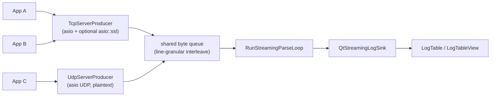

# Contributing

Thanks for your interest in contributing! This document is the developer reference for the project. It opens with an architecture deep-dive (project layout, the `loglib` headers, the GUI wrappers, the parsing data flow, and how to teach the viewer a new log format), then covers building from source, running the test suite and benchmarks, code style, the pull-request workflow, and the release process.

## Table of contents

- [Architecture](#architecture)
  - [Project Structure](#project-structure)
  - [Library](#library)
  - [GUI Application](#gui-application)
  - [Static vs Streaming pipelines](#static-vs-streaming-pipelines)
  - [Network producers (TCP / UDP)](#network-producers-tcp--udp)
  - [Data Flow](#data-flow)
  - [Adding a New Structured Log Format](#adding-a-new-structured-log-format)
  - [Adding a Regex Template](#adding-a-regex-template)
- [Prerequisites](#prerequisites)
  - [Third-party license bundle](#third-party-license-bundle)
- [Building](#building)
  - [Quick start](#quick-start)
  - [Windows](#windows)
  - [Machine-specific overrides (`CMakeUserPresets.json`)](#machine-specific-overrides-cmakeuserpresetsjson)
  - [Enabling system packages](#enabling-system-packages)
  - [Sanitizers and coverage](#sanitizers-and-coverage)
  - [IDE integration](#ide-integration)
- [Running tests](#running-tests)
  - [Targets](#targets)
  - [Common pitfalls](#common-pitfalls)
- [Benchmarking](#benchmarking)
  - [Fixture inventory](#fixture-inventory)
  - [Running](#running)
  - [WARN-line convention](#warn-line-convention)
  - [Acceptance bar](#acceptance-bar)
- [Code style and pre-commit](#code-style-and-pre-commit)
- [Pull requests](#pull-requests)
- [Repository security (maintainers)](#repository-security-maintainers)
- [Release process](#release-process)
  - [Steps](#steps)
  - [Verifying a release](#verifying-a-release)
  - [AppImage delta updates (zsync)](#appimage-delta-updates-zsync)
  - [Hotfix / re-tagging](#hotfix--re-tagging)

## Architecture

### Project Structure

The project is organized into two main components: the `library` and the GUI `app`.

```plaintext
structured_log_viewer/
├── library/                  # loglib: core log handling (no Qt dependency)
│   ├── include/loglib/       # Public library headers
│   │   ├── parsers/          # Format-specific parser headers (json_parser.hpp, logfmt_parser.hpp, csv_parser.hpp, ...)
│   │   └── internal/         # Internal-but-needed-by-tests headers
│   │                         #   (static_parser_pipeline.hpp,
│   │                         #    streaming_parse_loop.hpp,
│   │                         #    batch_coalescer.hpp,
│   │                         #    parse_runtime.hpp,
│   │                         #    buffering_sink.hpp,
│   │                         #    line_decoder.hpp,
│   │                         #    file_identity.hpp,
│   │                         #    timestamp_promotion.hpp,
│   │                         #    transparent_string_hash.hpp,
│   │                         #    compact_log_value.hpp,
│   │                         #    advanced_parser_options.hpp)
│   ├── src/                  # Library implementation (.cpp only;
│   │                         #   parsers/ subfolder mirrors include/)
│   └── CMakeLists.txt
├── app/                      # Qt6 GUI application (StructuredLogViewer)
│   ├── include/              # GUI headers
│   ├── src/                  # GUI implementation (including main_window.ui)
│   └── CMakeLists.txt
├── test/
│   ├── lib/                  # Catch2 unit tests and benchmarks for loglib
│   ├── app/                  # Qt Test smoke tests for MainWindow (+ JSONL/logfmt fixtures)
│   ├── common/               # Test helpers shared across lib/app/log_generator
│   └── log_generator/        # Standalone multi-format fixture generator (`log_generator`)
├── cmake/                    # Shared CMake modules (warnings, FetchContent)
├── resources/                # Icons, .desktop entry, Qt resource file
├── doc/                      # End-user documentation
├── .github/workflows/        # CI: build + test on Linux / Windows / macOS
├── CMakeLists.txt
└── README.md
```

### Library

The `library` component (`loglib`) provides the core functionality for handling structured log data and has no Qt dependency, so it can be reused in other applications. The headers are intentionally small; the table below is the recommended reading order for someone new to the codebase.

| Header                              | Role                                                                                                                                                                                                                                                                                                                                                                                                                                                                                                                                                                                                                                                                                                                                                                                                                                                                                                                                                                                                                                                                                                                                                                                                                                                                                                                                                                                                                                                                                                                                                                                                                                                                                                                                                                                                                                                                                                                                                                                                                                                                                                                                                                                                                                                                                                                                                                                                                                                                                                                                                                                                                                                                                                                                                                                                                                                                                                                                                                                                                                                                                                       |
| ----------------------------------- | ---------------------------------------------------------------------------------------------------------------------------------------------------------------------------------------------------------------------------------------------------------------------------------------------------------------------------------------------------------------------------------------------------------------------------------------------------------------------------------------------------------------------------------------------------------------------------------------------------------------------------------------------------------------------------------------------------------------------------------------------------------------------------------------------------------------------------------------------------------------------------------------------------------------------------------------------------------------------------------------------------------------------------------------------------------------------------------------------------------------------------------------------------------------------------------------------------------------------------------------------------------------------------------------------------------------------------------------------------------------------------------------------------------------------------------------------------------------------------------------------------------------------------------------------------------------------------------------------------------------------------------------------------------------------------------------------------------------------------------------------------------------------------------------------------------------------------------------------------------------------------------------------------------------------------------------------------------------------------------------------------------------------------------------------------------------------------------------------------------------------------------------------------------------------------------------------------------------------------------------------------------------------------------------------------------------------------------------------------------------------------------------------------------------------------------------------------------------------------------------------------------------------------------------------------------------------------------------------------------------------------------------------------------------------------------------------------------------------------------------------------------------------------------------------------------------------------------------------------------------------------------------------------------------------------------------------------------------------------------------------------------------------------------------------------------------------------------------------------------- |
| `loglib/log_file.hpp`               | `LogFile` memory-maps a log on disk and tracks line offsets. It outlives every `LogLine` parsed from it so values backed by `MmapSlice` stay valid for the file's whole on-screen lifetime.                                                                                                                                                                                                                                                                                                                                                                                                                                                                                                                                                                                                                                                                                                                                                                                                                                                                                                                                                                                                                                                                                                                                                                                                                                                                                                                                                                                                                                                                                                                                                                                                                                                                                                                                                                                                                                                                                                                                                                                                                                                                                                                                                                                                                                                                                                                                                                                                                                                                                                                                                                                                                                                                                                                                                                                                                                                                                                                |
| `loglib/line_source.hpp`            | `LineSource` is the polymorphic seam every `LogLine` carries (paired with a `lineId`). It owns the bytes backing each line, resolves `CompactTag::MmapSlice` / `OwnedString` payloads through `ResolveMmapBytes` / `ResolveOwnedBytes`, and carries a borrowed pointer to the session's `EnumDictionaryRegistry` so `DictRef` payloads can resolve too. `BytesAreStable()` discriminates mmap-backed sources from streaming ones; `SupportsEviction()` / `EvictBefore` are the retention hook used by `LogTable::EvictPrefixRows`.                                                                                                                                                                                                                                                                                                                                                                                                                                                                                                                                                                                                                                                                                                                                                                                                                                                                                                                                                                                                                                                                                                                                                                                                                                                                                                                                                                                                                                                                                                                                                                                                                                                                                                                                                                                                                                                                                                                                                                                                                                                                                                                                                                                                                                                                                                                                                                                                                                                                                                                                                                         |
| `loglib/file_line_source.hpp`       | `FileLineSource` adapts an owned `LogFile` to `LineSource` for the static `File → Open…` path. `BytesAreStable()` is `true`, so the parser keeps its zero-copy `MmapSlice` fast path. LineIds are 0-based file-line indices.                                                                                                                                                                                                                                                                                                                                                                                                                                                                                                                                                                                                                                                                                                                                                                                                                                                                                                                                                                                                                                                                                                                                                                                                                                                                                                                                                                                                                                                                                                                                                                                                                                                                                                                                                                                                                                                                                                                                                                                                                                                                                                                                                                                                                                                                                                                                                                                                                                                                                                                                                                                                                                                                                                                                                                                                                                                                               |
| `loglib/stream_line_source.hpp`     | `StreamLineSource` adapts a live `BytesProducer` to `LineSource` for Stream Mode. Lines are owned in a pair of `std::deque<std::string>`s (raw text + per-line owned arena), 1-based monotonic ids are assigned by `AppendLine`, and a mutex makes it safe for the parser worker to append while the GUI reads / evicts.                                                                                                                                                                                                                                                                                                                                                                                                                                                                                                                                                                                                                                                                                                                                                                                                                                                                                                                                                                                                                                                                                                                                                                                                                                                                                                                                                                                                                                                                                                                                                                                                                                                                                                                                                                                                                                                                                                                                                                                                                                                                                                                                                                                                                                                                                                                                                                                                                                                                                                                                                                                                                                                                                                                                                                                   |
| `loglib/bytes_producer.hpp`         | `BytesProducer` is the abstract byte feed behind `StreamLineSource`. `Read` / `WaitForBytes` form the parser's pull loop, `Stop()` unblocks I/O during teardown, and `SetRotationCallback` / `SetStatusCallback` surface rotation events and `Running` ↔ `Waiting` transitions to the GUI. The seam keeps the parser ignorant of where the bytes come from.                                                                                                                                                                                                                                                                                                                                                                                                                                                                                                                                                                                                                                                                                                                                                                                                                                                                                                                                                                                                                                                                                                                                                                                                                                                                                                                                                                                                                                                                                                                                                                                                                                                                                                                                                                                                                                                                                                                                                                                                                                                                                                                                                                                                                                                                                                                                                                                                                                                                                                                                                                                                                                                                                                                                                |
| `loglib/tailing_bytes_producer.hpp` | `TailingBytesProducer` is the file-tailing `BytesProducer`: a one-thread tailer that pre-fills the last *N* complete lines and follows growth via [`efsw`](https://github.com/SpartanJ/efsw) with a polling fallback. Survives rename-and-create / copy-truncate / in-place truncate / delete-then-recreate rotations and coalesces bursts within a 1 s window.                                                                                                                                                                                                                                                                                                                                                                                                                                                                                                                                                                                                                                                                                                                                                                                                                                                                                                                                                                                                                                                                                                                                                                                                                                                                                                                                                                                                                                                                                                                                                                                                                                                                                                                                                                                                                                                                                                                                                                                                                                                                                                                                                                                                                                                                                                                                                                                                                                                                                                                                                                                                                                                                                                                                            |
| `loglib/tcp_server_producer.hpp`    | `TcpServerProducer` is a multi-client TCP-listener `BytesProducer`. Each accepted session has a per-connection carry buffer so output from concurrent clients interleaves at line granularity into one shared queue. With `LOGLIB_NETWORK_TLS=ON` the same class accepts TLS connections via `asio::ssl::stream` (config under `Options::tls`); without it the binary is plaintext-only. Reports `SourceStatus::Waiting` until the first byte arrives.                                                                                                                                                                                                                                                                                                                                                                                                                                                                                                                                                                                                                                                                                                                                                                                                                                                                                                                                                                                                                                                                                                                                                                                                                                                                                                                                                                                                                                                                                                                                                                                                                                                                                                                                                                                                                                                                                                                                                                                                                                                                                                                                                                                                                                                                                                                                                                                                                                                                                                                                                                                                                                                     |
| `loglib/udp_server_producer.hpp`    | `UdpServerProducer` is the connectionless counterpart: each datagram becomes one or more complete log records (a missing trailing newline is appended so downstream line-splitting still works). Plaintext only — DTLS is intentionally out of scope. Reports `SourceStatus::Waiting` until the first datagram arrives, then `Running` (and never falls back, since there is no connection state to track).                                                                                                                                                                                                                                                                                                                                                                                                                                                                                                                                                                                                                                                                                                                                                                                                                                                                                                                                                                                                                                                                                                                                                                                                                                                                                                                                                                                                                                                                                                                                                                                                                                                                                                                                                                                                                                                                                                                                                                                                                                                                                                                                                                                                                                                                                                                                                                                                                                                                                                                                                                                                                                                                                                |
| `loglib/key_index.hpp`              | `KeyIndex` is an append-only intern table mapping a JSON field name (`"timestamp"`, `"level"`, …) to a dense `KeyId`. It is thread-safe; the parsing pipeline shares a single `KeyIndex` across all workers and the GUI's `LogTable` keeps it for the table's lifetime.                                                                                                                                                                                                                                                                                                                                                                                                                                                                                                                                                                                                                                                                                                                                                                                                                                                                                                                                                                                                                                                                                                                                                                                                                                                                                                                                                                                                                                                                                                                                                                                                                                                                                                                                                                                                                                                                                                                                                                                                                                                                                                                                                                                                                                                                                                                                                                                                                                                                                                                                                                                                                                                                                                                                                                                                                                    |
| `loglib/enum_dictionary.hpp`        | `EnumDictionary` is a per-column intern table for distinct string values (insertion-ordered, `EnumValueId` is `uint16_t`). Values live in a `std::deque<std::string>` so each address is stable, and the index keys on `string_view`s into those bytes. `EnumDictionaryRegistry` maps `KeyId` → `EnumDictionary` for every promoted column and supports multi-key aliasing via `Alias(canonical, alias)` (`[[nodiscard]] bool`). `LogTable` owns the registry; every `LineSource` borrows it so `Materialise(DictRef)` can resolve bytes. Single-writer (the `LogTable` thread); readers may run concurrently.                                                                                                                                                                                                                                                                                                                                                                                                                                                                                                                                                                                                                                                                                                                                                                                                                                                                                                                                                                                                                                                                                                                                                                                                                                                                                                                                                                                                                                                                                                                                                                                                                                                                                                                                                                                                                                                                                                                                                                                                                                                                                                                                                                                                                                                                                                                                                                                                                                                                                             |
| `loglib/log_line.hpp`               | `LogLine` holds one parsed record as a sorted vector of `(KeyId, internal::CompactLogValue)` pairs plus a `(LineSource *, lineId)` pair. `CompactLogValue` is a 16-byte union (mmap slice / owned-string offset / int / uint / double / bool / timestamp / monostate / `DictRef`); the `LineSource` resolves bytes regardless of source (mmap, live producer, or `EnumDictionary`).                                                                                                                                                                                                                                                                                                                                                                                                                                                                                                                                                                                                                                                                                                                                                                                                                                                                                                                                                                                                                                                                                                                                                                                                                                                                                                                                                                                                                                                                                                                                                                                                                                                                                                                                                                                                                                                                                                                                                                                                                                                                                                                                                                                                                                                                                                                                                                                                                                                                                                                                                                                                                                                                                                                        |
| `loglib/log_data.hpp`               | `LogData` owns the `KeyIndex`, all `LogLine`s, and the `LineSource`(s) they reference. It supports `Merge` for opening multiple files and `AppendBatch` for the streaming path; the static-path single-`LogFile` invariant only applies to `LogLine`s rooted in a `FileLineSource`.                                                                                                                                                                                                                                                                                                                                                                                                                                                                                                                                                                                                                                                                                                                                                                                                                                                                                                                                                                                                                                                                                                                                                                                                                                                                                                                                                                                                                                                                                                                                                                                                                                                                                                                                                                                                                                                                                                                                                                                                                                                                                                                                                                                                                                                                                                                                                                                                                                                                                                                                                                                                                                                                                                                                                                                                                        |
| `loglib/log_configuration.hpp`      | `LogConfiguration` lists visible columns (header, JSON keys, print format, `Type`, time-parse formats, a `visible` flag for the right-click "Hide column" UX, an optional `levelMapping` alias override list for `Type::Level` columns, filters with `Type::text` / `time` / `enumeration` / `boolean` / `number` and a `filterValues` enum-picker list plus optional `filterMinValue` / `filterMaxValue` for numeric ranges). `Column::visible` defaults to `true`; Glaze tolerates the missing key, so configurations saved by builds that pre-date the field still load with every column visible. `Type` has one **candidate** state (`unknown`, scanned by the auto-detector) and nine terminal states (`any`, `boolean`, `string`, `integer`, `floating`, `number`, `time`, `enumeration`, `level`); the type itself is the kill-once-stay-killed gate. `any` is the explicit user opt-out / mixed-bag sentinel (saved column type or auto-detector bail when no strings, no numerics, and no bools were observed) and stays distinct from inferred `string`. `level` is an `enumeration` subtype: storage stays as `DictRef`, the dictionary keeps the raw user strings, and a per-column `EnumValueId -> LogLevel` cache in `LogTable` powers canonical sort, filter, and styling against `loglib::LogLevel` (Trace < Debug < Info < Warn < Error < Fatal). `LogConfigurationManager` loads / saves the file, grows the layout via `AppendKeys`, and exposes `MoveColumn` (rotates `columns` and remaps every `LogFilter::row` so persisted filters follow the column) plus `SetColumnVisible` for the GUI's column-management UX.                                                                                                                                                                                                                                                                                                                                                                                                                                                                                                                                                                                                                                                                                                                                                                                                                                                                                                                                                                                                                                                                                                                                                                                                                                                                                                                                                                                                                                                                 |
| `loglib/log_table.hpp`              | `LogTable` pairs `LogData` with a `LogConfigurationManager`, owns the `BeginStreaming`/`AppendBatch` state machine, back-fills timestamps mid-stream, drives per-column `EnumCandidateTracker`s + `EnumDictionaryRegistry`, and exposes `EvictPrefixRows(count)`. `mIsStreaming` switches auto-detection between **stream-mode** (promote at 2 rows, no cardinality bail) and **static-mode** (4096 rows + cardinality bail; smaller files are caught by `FinalizeAutoDetection`). `FinalizeAutoDetection()` runs a permissive end-of-parse sweep (`presenceCount >= 2`) so small or slow logs still get enum UI. The default `EnumValueCap` of 64 catches truly high-cardinality columns before the ratio bail (`0.05`) even fires. `ResolveEnumColumn(columnIndex)` is the canonical seam GUI predicates / sort caches use to translate a visible column into a `KeyId` + `EnumDictionary*` pair. After a column promotes to `Type::Enumeration`, `MaybePromoteToLevel` checks the second-step rule: if the key matches `IsLogLevelKey` (`level`, `severity`, ...) and the dictionary satisfies the 1-in-4 canonical-vs-unrecognised tolerance (via `ResolveLevel`'s built-in aliases + per-column `levelMapping`), the type flips to `Type::Level` and `mLevelRankCache` is populated with the `EnumValueId -> LogLevel` mapping. `GetLevelForRow(row, columnIndex)` is the public accessor used by sort (`CompareLevel`), filter (`MainWindow::BuildRowPredicates`), and future row-styling code.                                                                                                                                                                                                                                                                                                                                                                                                                                                                                                                                                                                                                                                                                                                                                                                                                                                                                                                                                                                                                                                                                                                                                                                                                                                                                                                                                                                                                                                                                                                                                                                                      |
| `loglib/log_filter.hpp`             | The closed `RowPredicate = std::variant<EnumRowPredicate, TimeRangeRowPredicate, BoolRowPredicate, NumericRangeRowPredicate, CallbackStringRowPredicate>` plus a free `MatchesRow(predicate, table, row)` that `std::visit`s to the concrete `MatchesRow`. Predicates run straight against `LogTable`, so the GUI's `LogFilterModel` pays no `QVariant` allocation or virtual dispatch on the per-row hot path. `BoolRowPredicate` accepts `Type::Boolean` slots by an `includeTrue` / `includeFalse` toggle pair (both off rejects everything). `NumericRangeRowPredicate` accepts `int64_t` / `uint64_t` / `double` slots within an `std::optional<double>` min / max range (`nullopt` on either side means unbounded; `uint64_t > 2^53` casts through `double` with the documented precision loss). `CallbackStringRowPredicate` keeps Qt-flavoured regex / wildcard semantics on the app side via a caller-supplied callback.                                                                                                                                                                                                                                                                                                                                                                                                                                                                                                                                                                                                                                                                                                                                                                                                                                                                                                                                                                                                                                                                                                                                                                                                                                                                                                                                                                                                                                                                                                                                                                                                                                                                                                                                                                                                                                                                                                                                                                                                                                                                                                                                                                          |
| `loglib/log_compare.hpp`            | `CompareRows(table, lhsRow, rhsRow, columnIndex, rankForEnumColumn = nullptr)` is the three-way row comparator driving `LogFilterModel::lessThan`. Dispatches on the column's logical `LogConfiguration::Type` (`Boolean`, `Integer`, `Floating` / `Number`, `Time`, `Enumeration`, `Level`, `String` / `Any` / `Unknown`) and places `std::monostate` plus slots unrepresentable in that type into a tail bucket that ascending sorts pin past every populated value (`Boolean` sorts `false < true`; non-bool slots fall into the tail). `EnumDictRank` is the precomputed `EnumValueId` → alphabetic-rank table the proxy caches per enum column so per-compare string compares are avoided. `Type::Level` sorts by canonical `LogLevel` ordinal via `LogTable::GetLevelForRow` (Trace < Debug < ... < Fatal); unmapped slots (raw strings the alias table did not resolve) join the tail. `SortPermutationByColumn` has dedicated fast paths for both `Type::Enumeration` (uses `EnumDictRank`) and `Type::Level` (pre-materialises a `uint8_t` rank per row).                                                                                                                                                                                                                                                                                                                                                                                                                                                                                                                                                                                                                                                                                                                                                                                                                                                                                                                                                                                                                                                                                                                                                                                                                                                                                                                                                                                                                                                                                                                                                                                                                                                                                                                                                                                                                                                                                                                                                                                                                                         |
| `loglib/log_processing.hpp`         | Timezone bootstrap (`Initialize`), `TryParseTimestamp` fast/slow paths, and the `BackfillTimestampColumn` helper used by `LogTable`.                                                                                                                                                                                                                                                                                                                                                                                                                                                                                                                                                                                                                                                                                                                                                                                                                                                                                                                                                                                                                                                                                                                                                                                                                                                                                                                                                                                                                                                                                                                                                                                                                                                                                                                                                                                                                                                                                                                                                                                                                                                                                                                                                                                                                                                                                                                                                                                                                                                                                                                                                                                                                                                                                                                                                                                                                                                                                                                                                                       |
| `loglib/log_parser.hpp`             | `LogParser` is the format-agnostic interface (`IsValid`, two `ParseStreaming` overloads — one for `FileLineSource`, one for `StreamLineSource` — and `ToString`). Streaming is the only ingestion path the parser exposes; the synchronous "parse a file to a `ParseResult`" helper lives outside the base class as the free function `loglib::ParseFile(parser, path)` in `loglib/parse_file.hpp`.                                                                                                                                                                                                                                                                                                                                                                                                                                                                                                                                                                                                                                                                                                                                                                                                                                                                                                                                                                                                                                                                                                                                                                                                                                                                                                                                                                                                                                                                                                                                                                                                                                                                                                                                                                                                                                                                                                                                                                                                                                                                                                                                                                                                                                                                                                                                                                                                                                                                                                                                                                                                                                                                                                        |
| `loglib/log_parse_sink.hpp`         | `LogParseSink` is the receiver interface for the streaming parser; one `OnStarted`, zero or more `OnBatch(StreamedBatch)`, one `OnFinished(cancelled)`.                                                                                                                                                                                                                                                                                                                                                                                                                                                                                                                                                                                                                                                                                                                                                                                                                                                                                                                                                                                                                                                                                                                                                                                                                                                                                                                                                                                                                                                                                                                                                                                                                                                                                                                                                                                                                                                                                                                                                                                                                                                                                                                                                                                                                                                                                                                                                                                                                                                                                                                                                                                                                                                                                                                                                                                                                                                                                                                                                    |
| `loglib/parser_options.hpp`         | `ParserOptions::stopToken` for cooperative cancellation and `configuration` for inline timestamp promotion. Test-only tuning knobs (thread cap, batch size) live behind `loglib/internal/advanced_parser_options.hpp`.                                                                                                                                                                                                                                                                                                                                                                                                                                                                                                                                                                                                                                                                                                                                                                                                                                                                                                                                                                                                                                                                                                                                                                                                                                                                                                                                                                                                                                                                                                                                                                                                                                                                                                                                                                                                                                                                                                                                                                                                                                                                                                                                                                                                                                                                                                                                                                                                                                                                                                                                                                                                                                                                                                                                                                                                                                                                                     |
| `loglib/parsers/json_parser.hpp`    | `JsonParser`: the JSON Lines / NDJSON `LogParser`. The static `FileLineSource` overload runs the TBB pipeline over the mmap; the live-tail `StreamLineSource` overload runs the single-threaded streaming loop over `source.Producer()`. Both share simdjson via the per-worker decoder. `LogfmtParser` (`loglib/parsers/logfmt_parser.hpp`) is the second shipped parser: it follows the Heroku / `kr/logfmt` grammar, reuses the same two harnesses via a `LogfmtLineDecoder`, and types bare values (empty / `true` / `false` / integer / float / string) while leaving quoted values as strings. `CsvParser` (`loglib/parsers/csv_parser.hpp`) is the third shipped parser: RFC 4180 strict, comma-only, with a required header row; it shares the bare-scalar classifier with `LogfmtParser` (via `internal::ClassifyBareScalar`), uses the same TBB and streaming harnesses via a `CsvLineDecoder`, and swallows the header line as a `LineDecodeResult::Skip` in Stage B of batch 0 (so the static pipeline itself is byte-identical to the JSON / logfmt path). `RegexParser` (`loglib/parsers/regex_parser.hpp`) is the fourth shipped parser: it compiles a PCRE2-8 pattern with JIT, derives the column schema from the pattern's named capture groups, and -- like CSV / logfmt -- runs both the static TBB pipeline (sharing one read-only `pcre2_code*` plus its companion `pcre2_match_context*` across workers, each owning its own `pcre2_match_data*`) and the streaming loop through a `RegexLineDecoder`. The pattern is supplied externally (via `ParserOptions::configuration->source->regexPattern` or the explicit-pattern constructor) so `IsValid` only auto-detects the templates from the merged catalog -- built-ins shipped in `BuiltinRegexTemplates()` (`loglib/regex_templates.hpp`) plus user templates injected via `loglib::SetExtraRegexTemplates(std::span<const RegexTemplate>)` (the app calls this from `RegexTemplateRegistry` after scanning `<AppDataLocation>/regex_templates/*.json`). Each built-in lives in its own JSON file under `library/data/regex_templates/<slug>.json`, embedded at build time by `cmake/EmbedRegexTemplates.cmake`. Each template carries a `description` field (which, for ports, doubles as an upstream-source attribution — `lnav` BSD-2-Clause, `logstash-plugins/logstash-patterns-core` Apache-2.0, or vendor docs for nginx OSS BSD-2-Clause / Kubernetes `cri-api` Apache-2.0) and a `priority` field that controls probe order (lower probes first; user files default to a bucket after the built-ins). Built-ins always probe before user templates regardless of `priority`, so a careless user priority cannot steal a probe match from a shipped template; within each tier the merged list is stable-sorted by `priority`. Custom user patterns reach the parser through `File → Open Network Stream…` (custom-pattern field plus a `Save as template...` button that writes a new user JSON), a user file dropped under `<AppDataLocation>/regex_templates/`, or by restoring a saved session whose `LogConfiguration::Source` is already pinned to `Regex` + the desired pattern. The widened RFC3164 syslog template also matches ISO-8601 timestamps, so both `journalctl --output=short` and `journalctl --output=short-iso` flow through it without a second template. |
| `loglib/log_factory.hpp`            | `LogFactory::Create(Parser)` is the typed factory for the shipping `LogParser` implementations. The auto-detecting `loglib::ParseFile(path)` overload (in `loglib/parse_file.hpp`) probes every entry of the `Parser` enum via its `IsValid` content sniff and dispatches to the first match.                                                                                                                                                                                                                                                                                                                                                                                                                                                                                                                                                                                                                                                                                                                                                                                                                                                                                                                                                                                                                                                                                                                                                                                                                                                                                                                                                                                                                                                                                                                                                                                                                                                                                                                                                                                                                                                                                                                                                                                                                                                                                                                                                                                                                                                                                                                                                                                                                                                                                                                                                                                                                                                                                                                                                                                                              |

Several helpers live under `library/include/loglib/internal/` and are intentionally **not** part of the public API. They are kept there (rather than next to the `.cpp`s in `library/src/`) so the unit tests in `test/lib/` can include them via the same `loglib`-prefixed include path as the public headers, without needing a per-target include-directory workaround. The most important are:

- `BufferingSink` (`buffering_sink.hpp`) — the sink behind the `loglib::ParseFile(parser, path)` free helper.
- `loglib::internal::RunStaticParserPipeline` (`static_parser_pipeline.hpp`) — the TBB three-stage pipeline used for static-file parses; see [Static vs Streaming pipelines](#static-vs-streaming-pipelines).
- `loglib::internal::RunStreamingParseLoop` (`streaming_parse_loop.hpp`) — the single-threaded read / decode / batch loop used for live tailing.
- `BatchCoalescer` (`batch_coalescer.hpp`) — shared by both pipelines for the "flush every ~1000 lines or 50 ms / ~250 lines or 100 ms" coalescing and the `newKeys` diff against `KeyIndex`.
- `loglib::detail::FileIdentity` (`file_identity.hpp`) — POSIX `(st_dev, st_ino)` / Windows `GetFileInformationByHandle` helper used by `TailingBytesProducer` for rotation detection.
- `CompactLineDecoder` (`line_decoder.hpp`) — the single-line decoder concept that the streaming loop drives; returns a tri-state `LineDecodeResult { Emit, Skip, Error }`. `JsonParser` provides the JSON instance, `LogfmtParser` the logfmt instance, `CsvParser` the CSV instance (the only decoder that currently uses `Skip`, to swallow its schema header), and `RegexParser` the regex instance (each worker carries its own `pcre2_match_data*`; the `pcre2_match_context*` is held read-only on the shared `CompiledPattern` and configured with `pcre2_set_match_limit` / `pcre2_set_depth_limit` so a pathological backtracker on one line cannot stall the whole parse — PCRE2 explicitly allows sharing a single match context across threads when the limits are not mutated at runtime).
- `ClassifyBareScalar` (`classify_bare_scalar.hpp`) — shared inline header with `TryParseFiniteDouble`, `MakeStringCompact`, and `ClassifyBareScalar`. Both `LogfmtParser` and `CsvParser` use it to type unquoted values; inline (not a separate TU) so each parser keeps within-TU inlining regardless of LTO.
- The shared scratch types both pipelines use live in `parse_runtime.hpp`; `timestamp_promotion.hpp`, `compact_log_value.hpp`, and `transparent_string_hash.hpp` round out the set.

### GUI Application

The `app` component is a Qt 6 Widgets application. It uses `loglib` for parsing and data management and exposes the data through `QAbstractTableModel` / `QSortFilterProxyModel` subclasses with support for sorting, filtering, searching, configurable columns, and live-tail streaming.

The Qt-side classes that wrap `loglib` are:

- `LogModel` (`app/include/log_model.hpp`) — a `QAbstractTableModel` that owns the `LogTable`, the `QtStreamingLogSink`, the active parser `QFutureWatcher`, and (in Stream Mode) the live `BytesProducer`. Exposes a custom `EnumValueRole` (kept for external readers; the filter proxy now drives predicates directly off the table) and emits `enumColumnsChanged` whenever a column flips into or out of `Type::Enumeration` so `MainWindow` can rebuild the filter editor's column list and `LogFilterModel` can drop its cached enum sort ranks. Population is always streaming-driven through one of two entry points:

  - `BeginStreaming(unique_ptr<FileLineSource>, parseCallable)` / `AppendStreaming(...)` for the static `File → Open…` queue.
  - `BeginStreaming(unique_ptr<StreamLineSource>, ParserOptions, LogParserFactory = {})` for Stream Mode; spawns the parser worker (the `LogParserFactory` thunk constructs a `JsonParser`, `LogfmtParser`, or `CsvParser` per the persisted `Source::Format`; an empty factory defaults to `JsonParser` so existing call sites stay working) and re-emits `rotationDetected` / `sourceStatusChanged` from the source's worker thread via queued connections.
    Both paths converge on `AppendBatch(StreamedBatch)`. With a non-zero `RetentionCap()` (Stream Mode), `AppendBatch` FIFO-evicts the visible row prefix before insertion and head-trims over-cap batches first so per-batch eviction stays O(cap). `Reset()` runs the full teardown (`BytesProducer::Stop()` → sink `RequestStop()` → worker join → paused-buffer flush → `DropPendingBatches()`); `StopAndKeepRows()` runs the same teardown but preserves the visible rows so the user can keep working on them after Stop.

- `QtStreamingLogSink` (`app/include/qt_streaming_log_sink.hpp`) — the bridge that turns a `loglib::LogParseSink` callback running on a TBB / streaming worker thread into a `LogModel::AppendBatch` call on the GUI thread. `OnBatch` enqueues into a bounded SPSC `BoundedBatchQueue` (default capacity 32) and, on the queue's empty-to-non-empty edge, posts a single `Drain` lambda via `Qt::QueuedConnection`; subsequent enqueues until the lambda runs are coalesced under a `mDrainScheduled` atomic. The drain pulls everything pending and applies it to the model in one `AppendBatch` call. The queue gives end-to-end back-pressure: once it fills, `WaitEnqueue` parks the worker, which propagates through `BatchCoalescer` → TBB Stage C → Stage A so the parser runs at the GUI's pace and resident in-flight rows stay bounded regardless of file size. The sink owns a generation counter so a fresh `Arm()` (or a `RequestStop()`) drops any still-queued batches from a previous parse, and a separate bounded paused buffer with `Pause` / `Resume` / `SetRetentionCap` / `TakePausedBuffer` for the Stream-Mode toolbar (`Resume` coalesces the buffered batches into a single queued post). `PausedDropCount()` reports how many lines were FIFO-evicted from the paused buffer for the status bar's `… , X dropped while paused` suffix.

- `BoundedBatchQueue` (`app/include/bounded_batch_queue.hpp`) — header-only SPSC queue (`std::mutex` + `std::condition_variable` + `std::deque`) that backs `QtStreamingLogSink::mPending`. Producer side blocks in `WaitEnqueue` once the queue holds `capacity` items; consumer side never blocks (`DrainAll` moves every buffered item out). Cancellation is explicit via `NotifyStop`, which broadcasts to wake any parked producer immediately — this is paired with `RequestStop()` so teardown does not deadlock against `mStreamingWatcher->waitForFinished()`. We do not use `std::stop_token` because `loglib::StopToken` (see `library/include/loglib/stop_token.hpp`) is intentionally callback-free for macOS toolchain compatibility.

- `RowOrderProxyModel` (`app/include/row_order_proxy_model.hpp`) — optional newest-first reversal layer between `LogModel` and `LogFilterModel`. A custom `QAbstractProxyModel` that does O(1)-per-row mirror mapping (no internal sort, no mapping table); structural source signals are translated and forwarded so streaming a 1 GB file scales linearly instead of the prior O(N² log N) behaviour. Driven exclusively from `MainWindow::ApplyDisplayOrder`, which keeps the proxy direction, the `LogTableView` tail edge, and the alternating-row-colours flag in lockstep, and which picks per-mode whether to consult `StreamingControl::IsNewestFirst()` (stream sessions) or `StreamingControl::IsStaticNewestFirst()` (static sessions).

- `LogFilterModel` (`app/include/log_filter_model.hpp`) — custom `QAbstractProxyModel` over `RowOrderProxyModel` implementing the multi-column filter set in the [user guide](doc/README.md#filtering). The proxy owns an explicit `std::vector<int> mAcceptedSourceRows` row-projection map (plus an O(1) reverse `mSourceRowToProxyRow`) and rebuilds it from scratch on filter / sort changes, skipping the per-row `QModelIndex` / `QVariant` round-trip that `QSortFilterProxyModel` forces. `MainWindow::UpdateFilters` orders rules cheapest-first (`BoolRowPredicate` → `EnumRowPredicate` → `TimeRangeRowPredicate` → `NumericRangeRowPredicate` → `CallbackStringRowPredicate`) so the `std::ranges::all_of` walk short-circuits on the cheapest rejection. The view chain is `LogModel → RowOrderProxyModel → LogFilterModel → LogTableView`. Heavy work lives in `loglib`:

  - Filter pass: `RebuildAcceptedRows` calls `loglib::FilterAcceptedRows(table, mFilterRules)` under `tbb::parallel_for` with thread-local buckets. The lib returns log-row indices in ascending order; the proxy lifts each to `sourceModel()` coords with one `mapFromSource` hop through a cached `mProxyChainAbove` (depth 1 in production; depth 0 when a test wires `LogModel` directly).
  - Sort permutation: `ApplySortPermutation` resolves every survivor's log row once up front, then calls `loglib::SortPermutationByColumn(table, logRows, column, ascending, rank)`. The lib pre-materialises a `uint16_t` rank per row in parallel for `Type::Enumeration` columns and sorts via `tbb::parallel_sort` with an input-index tie-break (stable without `parallel_stable_sort`). The `EnumDictRank` cache is keyed by canonical `loglib::KeyId` so it survives column reorders without a `columnsMoved` hook, and `EnumRankFor` self-heals when the live dictionary grows past the cached size or its `EnumDictionary*` pointer changes (covers demote → re-promote at the same `Size()`).
  - Selection preservation: `SnapshotPersistentIndices` + `RemapPersistentIndicesForRebuild` run on every rebuild so views keep their selection across filter / sort changes (structural emit is `layoutAboutToBeChanged` / `layoutChanged`, not `modelReset`).

  Benchmark gates (1 M rows, level enum column, Release): proxy roundtrips `BenchEnumFilterApply < 500 ms` and `BenchEnumColumnSort < 1000 ms` (in `test/app/src/benchmark_main_window.cpp`); lib-side `loglib::FilterAcceptedRows < 100 ms` and `loglib::SortPermutationByColumn < 500 ms` (in `test/lib/src/benchmark_log_filter.cpp`). Concrete predicates live in `library/include/loglib/log_filter.hpp` as a closed `std::variant<EnumRowPredicate, TimeRangeRowPredicate, BoolRowPredicate, NumericRangeRowPredicate, CallbackStringRowPredicate>`:

  - `loglib::CallbackStringRowPredicate` — exactly / contains / regex / wildcard via a caller-supplied callback so Qt's regex flavours stay app-side. `MainWindow::MakeStringMatcher` pre-compiles the regex once at submission and the matcher captures it by value; it also takes an ASCII fast path via `LogModel::IsSingleLineAsciiTrim` for `Exactly` / `Contains` when both pattern and haystack are canonical ASCII single-line, collapsing to `std::string_view::operator==` / `find` (no `QString::fromUtf8` + `simplified()` per row). `MainWindow::FilterSubmitted` probes `QRegularExpression::isValid()` up front so invalid patterns are rejected with a status-bar message instead of silently hiding every row.
  - `loglib::TimeRangeRowPredicate` — inclusive begin/end range; `MainWindow::FilterTimeStampSubmitted` rejects an inverted range at submission so the predicate never sees `begin > end`.
  - `loglib::EnumRowPredicate` — multi-select equality on `Type::Enumeration` columns; pre-resolves selected strings to a `vector<bool>` indexed by `EnumValueId` for the fast path and falls back to a transparent-hash `unordered_set<string>` for rows whose slot is not yet a `DictRef`.
  - `loglib::BoolRowPredicate` — `Type::Boolean` slot equality via an `includeTrue` / `includeFalse` toggle pair. Non-bool slots reject; both toggles off rejects every row (`MainWindow::FilterBooleanSubmitted` blocks that submission upstream so the predicate never sees the all-off case at runtime).
  - `loglib::NumericRangeRowPredicate` — `std::optional<double>` min / max range over `int64_t` / `uint64_t` / `double` slots (`nullopt` on either side means unbounded). The visitor casts through `double` (precision loss above `2^53` is acceptable for filter UX); `NaN` bounds are treated as unbounded. `MainWindow::FilterNumericRangeSubmitted` rejects an inverted range and the both-sides-unbounded no-op at submission.

  A free `loglib::MatchesRow(predicate, table, row)` overload `std::visit`s to the concrete `MatchesRow` at compile time, so the per-row hot path pays neither a heap allocation nor a virtual dispatch. The comparator, the rank, and the parallel filter / sort entry points live in `library/include/loglib/log_compare.hpp` and `library/include/loglib/log_filter.hpp` — TBB stays a `loglib`-only dependency so GUI translation units remain framework-pure.

  Sorting behaviour: `loglib::CompareRows` is a total three-way comparator dispatched on the column's logical type. In an ascending sort `std::monostate` and slots not representable in the column's logical type (NaN in `Integer`, a stray string slot in `Floating`, etc.) share the *tail*: they compare equal to one another and strictly greater than every populated, representable value. Per-type membership of that tail bucket is documented on `CompareRows` and pinned by `test/lib/src/test_log_compare.cpp`. This is a deliberate change from the pre-`CompareRows` behaviour, where invalid `QVariant`s (the prior representation of monostate slots) sorted to the *top* of an ascending sort; if a saved configuration relies on the old order, click the column header to invert direction.

- `LogTableView` (`app/include/log_table_view.hpp`) — `QTableView` subclass that owns the `TailEdge` (`Bottom` by default, `Top` in newest-first mode) and emits edge-triggered `userScrolledAwayFromTail` / `userScrolledToTail` signals. `MainWindow` wires those to auto-disengage / auto-re-engage **Follow newest** without fighting programmatic scrolls. In newest-first mode the view also runs the chat-app reading-position preservation pattern around `rowsInserted` / `layoutChanged`, anchoring the topmost visible row across batches so the user's place in history is stable while new lines arrive on top.

- **Column reorder & hide.** The horizontal header has `setSectionsMovable(true)` and `setContextMenuPolicy(Qt::CustomContextMenu)` while idle, but `MainWindow::SetConfigurationUiEnabled(false)` flips both back off for the duration of every streaming session (alongside Load/Save/Preferences) so a header drag cannot race with parser-thread `AppendKeys` mutating `mConfiguration.columns`. The `View` menu is intentionally **not** gated -- it stays reachable as the escape hatch even mid-stream and only flips `Column::visible` (no rotation, no key-cache mutation). Dragging a section fires `QHeaderView::sectionMoved`, which `MainWindow::OnHeaderSectionMoved` translates into a source-mutating `LogModel::MoveColumn(src, dest)` plus a remap of the live `mFilters` map (via the static `LogConfigurationManager::RemapColumnIndexAfterMove`). `LogConfigurationManager::MoveColumn` rotates the persisted `columns` vector and remaps every `LogConfiguration::filters[*].row` in one shot, so saved filters always follow their column. After the source move the header's visual order is reset to identity (visual == logical) by `MainWindow::ResetHeaderToIdentity()` under a re-entrancy guard backed by `qScopeGuard` (so a thrown exception cannot latch the guard); a `Q_ASSERT_X(oldVisualIndex == logicalIndex)` documents the precondition that drag-fired `sectionMoved` runs against an identity-mapped header, and a matching runtime guard in release builds restores identity and bails when that precondition is violated (so a stale visual permutation cannot scramble the source layout). Right-clicking the header pops the menu built by `MainWindow::BuildHeaderContextMenu(logical)`: a `Hide "<header>"` entry (only emitted when the clicked column is currently visible — production right-clicks only fire on visible sections, but the public test seam can target a hidden one) that calls `MainWindow::SetColumnVisible(idx, false)` (which flips `Column::visible` and `QHeaderView::setSectionHidden`, and also resets the sort to the unsorted baseline if the user just hid the column carrying the active sort indicator -- otherwise a sorted-then-hidden column would leave the sort active with no UI to clear it), plus a `Show column ▶` submenu (only present when at least one column is hidden) that re-enables a chosen column. Header labels in the `Hide` / `Show column` / `View` menus go through `MainWindow::ColumnMenuLabel(idx)`, which appends `[key1,key2]` when two columns share the same `header` so duplicate-headered columns stay distinguishable (Qt allows duplicate headers; `Column::keys` is the stable identifier). The Hide / Show / `View` menu lambdas capture each column's stable `LogConfiguration::Column::keys` snapshot rather than its transient logical index and re-resolve via `MainWindow::FindColumnIndexByKeys(keys)` at trigger time, so a streaming-induced column move (e.g. timestamp-bubble auto-promotion) between menu construction and click does not strand the action on the wrong column. The Edit action on per-filter sub-menus follows the same pattern: it captures the filter `id` and reads the live `mFilters[id]` at trigger time, otherwise a reorder between menu build and Edit would freeze `filter.row` at the old index and `AddFilter`'s type-match guard would silently drop the filter (regression test `TestEditFilterAfterColumnReorderUsesCurrentRow`). The `View` menu is the always-reachable escape hatch: it is rebuilt from the live configuration on every `aboutToShow` (`MainWindow::RebuildViewMenu`) and lists every column as a checkable `QAction`, so the user can restore visibility even when every header section is hidden. `MainWindow::ApplyColumnVisibility()` reapplies every column's `visible` flag to the header and is wired to `QAbstractItemModel::modelReset` (so any path that resets the model — `Reset`, `BeginStreaming`, teardown — picks up the persisted flags automatically) plus an explicit call inside both `TryLoadAsConfiguration` and `LoadConfiguration` after a `LogModel::NotifyConfigurationReplaced()` brackets a `beginResetModel` / `endResetModel` so the header re-initialises its section count after the in-place `LogConfigurationManager::Load` rewrites the columns vector without emitting any Qt model signal. `LogFilterModel::MatchRow` (the engine behind **Find**) skips columns whose `Column::visible` is false, so a Find hit on an invisible cell can never strand the user with a row scrolled into view but no visible matched cell. `BuildHeaderContextMenu` is public because the offscreen-QPA `findChild<QMenu*>` traversal bug (see `FiltersMenu()`) blocks the natural test path.

- **Session persistence.** Filters, sort, and source round-trip through **Save Session\\u2026** / **Load Configuration\\u2026** (which now loads either shape); columns alone round-trip through the portable **Save Configuration\\u2026** action. The wire-format fields live in lib (`LogConfiguration::filters`, `LogConfiguration::sort`, `LogConfiguration::source`), the runtime UUID-keyed map lives in app (`MainWindow::mFilters`), and the two stores are kept in lockstep by a single eager-mirror call: `MainWindow::MirrorSessionStateToConfiguration()` snapshots the live filter map plus `LogFilterModel::SortColumn() / SortOrder()` plus `mCurrentSource` into the wire-format fields and is invoked from every mutation point (`AddLogFilter`, `ClearFilter`, `ClearAllFilters`, and the column-reorder remap inside `OnHeaderSectionMoved`). The mirror is also called defensively from `DoSaveConfiguration` to document intent. The filter snapshot is sorted by `(row, type, payload)` before it lands in the wire-format vector, so two consecutive `Save`s of the same filter set produce byte-identical JSON and the load-side menu ordering survives round-trips even though UUIDs are GUI-internal and *not* persisted; they are regenerated on load (the source `unordered_map`'s iteration order is irrelevant). The save flow has two scopes selected by `loglib::SaveScope`: `ColumnsOnly` writes only `columns` (the **Save Configuration\\u2026** action; portable across data sources), `Full` writes the full struct (the **Save Session\\u2026** action). The load path is unified: missing session fields default to their inert values (`filters` empty, `sort.columnIndex == -1`, `source == nullopt`), so a configuration-shape file loads as "columns only, no filters, no sort, no source bound". The new lib mutator `LogConfigurationManager::SetFilters(std::vector<LogFilter>)` is the single path through which the manager's `mConfiguration.filters` is replaced (matching the existing `SetColumnVisible` / `MoveColumn` shape) — `Configuration()` stays const-only. `LogConfigurationManager::SetSort` and `SetSource` are siblings on the same mirror path. `LogConfigurationManager::Load` is *atomic on parse failure*: it reads into a temporary `LogConfiguration`, validates Glaze parsed it cleanly, and only then moves it into `mConfiguration`. Without that swap, Glaze's member-by-member writes would leave the live state half-populated when the parse threw mid-file, and `MainWindow::TryLoadAsConfiguration`'s catch-and-fall-through-to-streaming path would inherit the corruption (regression-tested by `Failed Load leaves the previous configuration intact`). On the load side, `MainWindow::RebuildFiltersFromConfiguration()` runs after `LogConfigurationManager::Load` (from both `DoLoadConfiguration` and the speculative single-file `TryLoadAsConfiguration`): it copies the freshly-loaded vector out, drops runtime + menu state via `ClearAllFilters`, then walks each saved filter through the shared `ValidateFilterAgainstColumns(filter, columns)` helper. Surviving filters are revived via `AddLogFilter(QUuid::createUuid().toString(), filter, /*deferSync=*/true)`; a single trailing `MirrorFiltersToConfiguration` + `UpdateFilters` runs after the loop so the bulk path stays O(N) instead of O(N^2). The validator is the single source of truth for "is this saved filter still usable" and covers six failure modes — out-of-range column index, type mismatch (e.g. a string filter against a column that auto-promoted to enum), empty enum selection, and missing payloads for time / numeric / string / boolean. The existing in-`AddFilter` pre-guard now calls the validator and only reacts to the empty-enum and type-mismatch reasons (preserving the legacy status-bar UX with a fallthrough into the editor on type-mismatch); the post-editor "missing payload" guards remain inline because they need the editor object to delete on failure. Drops surface through `MainWindow::ShowDroppedFiltersDialog(count, message)`, which is modelled on `ShowParseErrors` and lists each dropped filter as `column 'X' (row N): <reason>` (capped at 20 entries with `... and N more.` overflow). Tests reach the dialog through the `LOGAPP_BUILD_TESTING` seam `SetSuppressDialogsForTest(true)` plus `LastDroppedFilterCountForTest()` so the modal does not block the test thread under offscreen-QPA. The dialog-driven `SaveConfiguration` / `LoadConfiguration` slots delegate to `DoSaveConfiguration` / `DoLoadConfiguration` path-based helpers, which the test seams `SaveConfigurationToPathForTest` / `LoadConfigurationFromPathForTest` invoke directly so the round-trip can be exercised headlessly. Two consequences worth noting: (1) the lib's `LogConfigurationManager::MoveColumn` filter-row remap is now *meaningful in production* (previously it operated on a permanently empty vector because nothing wrote to `mConfiguration.filters`); (2) `OnHeaderSectionMoved` keeps both the lib-side rotation (inside `MoveColumn`) and the explicit `mFilters[*].row` remap loop, then re-mirrors at the end so both stores remain bit-identical regardless of any future divergence in the lib's internal remap details. Regression tests: `TestFilterPersistenceRoundtrip`, `TestFilterPersistenceMultipleTypes`, `TestFilterPersistenceDropsInvalidFilters`, `TestFilterPersistenceSaveOrderingIsDeterministic`.

- **Column editing.** `ColumnEditor` (`app/include/column_editor.hpp`) is a modal `QDialog` that drives the only user-facing path for changing per-column metadata: `header`, `type`, `autoDetect`, and `visible`. Entry points are the header right-click menu ("Edit column "X"\\u2026"; gated only by the column existing, not its visibility, so the editor is also the place to re-show a hidden column), a double-click on a diagnostics-dialog row (which emits `ConfigurationDiagnosticsDialog::editColumnRequested(int)`; `MainWindow` wires this to `EditColumn(int)` once when the dialog is lazily constructed), and the columns manager's **Edit\\u2026** button (which also routes through `MainWindow::EditColumn` so the post-accept visibility / status-bar refresh fires identically). The `Type` combo collapses the `(Type::Any, autoDetect == true)` pair into a single "Auto-detect" entry at the top; "Any (treat as string)" stays as a distinct option for `Type::Any` with `autoDetect == false`. `Apply()` writes through `LogConfigurationManager::SetColumnHeader / SetColumnVisible / SetColumnType / SetColumnAutoDetect`, then calls `LogModel::RefreshColumnHealth()` and emits `headerDataChanged` / `dataChanged` so the table, header tooltip, decoration icon, and diagnostics status bar all flip in lockstep. `SetColumnHeader` is a new lib mutator; it renames the display label without touching `keys` (the parser's stable identifier), and out-of-range indices are a silent no-op like the rest of the `SetColumn*` family. Regression tests: `TestColumnEditorAppliesEveryField`, `TestColumnEditorAutoDetectChoiceRestoresFlag`, `TestDiagnosticsDialogDoubleClickEmitsEditRequest`.

- **Columns manager.** `ColumnsManagerDialog` (`app/include/columns_manager_dialog.hpp`) is the bulk surface that exposes every column at once and is the only entry point that handles reorder + visibility + drill-down in one place. It is a modeless `QDialog` (lazy-owned by `MainWindow::mColumnsManagerDialog`, surviving close so a second open reuses the same window) that lays out one row per `LogConfiguration::Column` with five cells — Header, Keys, Type (auto-detect collapses into "Auto-detect" the same way it does in the column editor), Auto-detect (Yes/No), Visible (in-place `Qt::ItemIsUserCheckable` checkbox). The Move up / Move down buttons go through `LogModel::MoveColumn(src, dest)` (the same path the header drag uses, so filter row-remap and saved sort indices remain in lockstep), Edit\\u2026 routes through `MainWindow::EditColumn(int)` (and a row double-click does the same), and the Visible checkbox writes through `MainWindow::SetColumnVisible(int, bool)` rather than the lib mutator directly so the header `setSectionHidden` flag, the View menu's checked state, and the sort-on-hidden-column reset all stay coherent. The table auto-refreshes when `LogModel::modelReset`, `LogModel::headerDataChanged`, or `LogModel::columnHealthChanged` fires, so out-of-band column moves (header drag, streaming-driven type promotion, configuration load) never leave the manager lying to the user. Entry point: the **Manage columns\\u2026** action at the top of the rebuilt `View` menu (`MainWindow::RebuildViewMenu` adds it before the separator and the per-column toggle list, so it stays reachable even when zero columns exist). The Move-up / Move-down boundary clamps to a no-op (rather than wrap / assert) so a user can mash the button without breaking the model. Regression tests: `TestColumnsManagerListsEveryColumn`, `TestColumnsManagerVisibilityToggleHidesColumn`, `TestColumnsManagerMoveDownReordersColumns`, `TestColumnsManagerMoveAtBoundariesIsNoOp`, `TestViewMenuManageColumnsActionOpensDialog`.

- **Configuration diagnostics.** `LogTable::ComputeColumnTypeHealth(columnIndex)` returns `{totalSlots, presentSlots, matchingSlots}` per column; the app caches this snapshot on `LogModel::mColumnHealth` and only recomputes when something changes — `RefreshColumnHealth` runs in `TeardownStreamingSessionInternal(resetTable=true)` so post-reset state clears, and `MainWindow`'s `streamingFinished` handler runs it again once data has settled. The cache hangs off three Qt surfaces: (1) `LogModel::headerData(section, Horizontal, ToolTipRole)` renders a per-column HTML tooltip listing keys, configured type, and (when `presentSlots > matchingSlots`) a red "N of M values do not match the configured type" line; (2) `headerData(..., DecorationRole)` returns `QStyle::SP_MessageBoxWarning` so the mismatched header gets a small triangle next to the label; (3) a status-bar `QPushButton` (`MainWindow::mDiagnosticsButton`, object name `diagnosticsButton`) shows `"N column mismatch(es)"` and opens the modeless `ConfigurationDiagnosticsDialog`. The dialog walks the same `LogModel::ColumnHealth` snapshot (no second table scan) and exposes header / configured type / auto-detect / total / present / matching / mismatched / mismatch%; auto-refresh is wired to `LogModel::columnHealthChanged` so a column-editor change re-renders without re-opening the window. Aggregation goes through `ConfigurationDiagnosticsDialog::MismatchedColumnCount(model)` so the status bar and the dialog cannot disagree. Tests use `findChild<QPushButton*>("diagnosticsButton")` and `isHidden()` (not `isVisible()`, which collapses to false on the offscreen-QPA hidden parent). Regression tests: `TestColumnHealthFlagsMismatchedType`, `TestDiagnosticsButtonSurfacesMismatchCount`, `TestDiagnosticsDialogListsMismatchedColumns`.

- `StreamingControl` (`app/include/streaming_control.hpp`) — `QSettings`-backed transactional store for the **Streaming** and **Static (file mode)** groups of `PreferencesEditor` (retention cap, stream-mode newest-first flag, static-mode newest-first flag). Ok / Cancel transactional pattern: in-memory mutation, `SaveConfiguration` commits to `QSettings`, `LoadConfiguration` reverts the in-memory state to the persisted values.

- `PreferencesEditor` (`app/include/preferences_editor.hpp`) — Qt widget hosting the **Theme**, **Streaming**, **Static (file mode)**, and **Session History** groups; emits `streamingRetentionChanged` / `streamingDisplayOrderChanged` / `staticDisplayOrderChanged` / `showLevelIconsChanged` / `highContrastLevelsChanged` on Ok so `MainWindow::ApplyDisplayOrder` and the theme/level-icon hooks can re-apply them live with mode-aware dispatch. The Theme group is wired through `ThemeControl` (`app/include/theme_control.hpp`) — single owner of the active theme, the per-`LogLevel` brush / font / icon cache, and the Auto-mode `colorSchemeChanged` listener that re-resolves Light \<-> Dark on OS palette flips. User themes live under `<AppDataLocation>/themes/*.json` and shadow built-ins by `name`; built-ins ship under `resources/themes/*.json`.

- `RegexTemplatesEditor` (`app/include/regex_templates_editor.hpp`) — dedicated modeless editor for the merged regex-template catalog, opened from `Settings → Regex templates...`. Splits into a list of every template (built-in + user, with `(user)` / `(manual only)` badges) on the left and an inline form on the right (`name`, `pattern`, `sampleLines`, `autoDetect`, `priority`, `description`). `description` is a multiline free-form paragraph that explains what the template parses and (for ports) cites the upstream source and licence. Built-ins are read-only — their bytes live in the binary, so `Duplicate selected` is the path to customise them. User templates can be created (`New template...`), edited in place, validated (`Validate` compiles via `loglib::ValidateRegexPattern` and self-tests each sample via `loglib::PatternMatchesLine`), saved (`Save` writes via `RegexTemplateRegistry::SaveUserTemplate`), reverted, or deleted (`Delete user template` calls `RegexTemplateRegistry::DeleteUserTemplate` which unlinks the JSON file and re-injects extras into `loglib`). `Open templates folder` and `Reload from disk` round out the registry-management surface. The editor is wired through `RegexTemplateRegistry` (`app/include/regex_template_registry.hpp`) — single owner of the merged regex-template catalog (built-ins from `loglib::BuiltinRegexTemplates()` plus user files under `<AppDataLocation>/regex_templates/*.json`); the registry calls `loglib::SetExtraRegexTemplates(...)` on every rescan so the library probe loop sees user templates without any per-call plumbing on the parser side. Built-in JSONs live under `library/data/regex_templates/` and are embedded at build time. User files shadow built-ins by `name` with the same warning shape as `ThemeControl`. The `NetworkStreamDialog` only consumes the registry (for the regex-template picker); template lifecycle is intentionally not in that dialog.

- `MainWindow` (`app/include/main_window.hpp`) — orchestrates everything: open dialogs, drag & drop, the find bar, the filter editor, the preferences editor, the sequential file-queue open flow (`StartStreamingOpenQueue` / `StreamNextPendingFile`) that drives `LogModel::BeginStreaming` for the first file and `LogModel::AppendStreaming` for the rest, and the Stream Mode entry point (`OpenLogStream` → `LogModel::BeginStreaming(StreamLineSource, ...)`) plus the toolbar wiring (`TogglePauseStream` / `StopStream`) and the status-bar state machine (`UpdateStreamingStatus` covers the `Streaming` / `Paused` / `Source unavailable` / `— rotated` / `dropped while paused` variants).

### Static vs Streaming pipelines

`LogParser` exposes two `ParseStreaming` overloads, each backed by a different in-library driver. They share the sink contract, the `KeyIndex` / `LogConfiguration` plumbing, and `BatchCoalescer`, but differ in concurrency model and byte source. Pick the one that matches your input.

| Aspect                | Static pipeline (`RunStaticParserPipeline`)                                                                                       | Streaming loop (`RunStreamingParseLoop`)                                                                                                                                                                    |
| --------------------- | --------------------------------------------------------------------------------------------------------------------------------- | ----------------------------------------------------------------------------------------------------------------------------------------------------------------------------------------------------------- |
| **Header**            | `loglib/internal/static_parser_pipeline.hpp`                                                                                      | `loglib/internal/streaming_parse_loop.hpp`                                                                                                                                                                  |
| **Parser entry**      | `LogParser::ParseStreaming(FileLineSource&, LogParseSink&, ParserOptions)`                                                        | `LogParser::ParseStreaming(StreamLineSource&, LogParseSink&, ParserOptions)`                                                                                                                                |
| **Use case**          | Static `File → Open…` queue, `loglib::ParseFile(parser, path)`, the `[parse_sync]` / `[large]` / `[wide]` benchmarks.             | Stream Mode (live tail), the `[stream_latency]` benchmark.                                                                                                                                                  |
| **Concurrency**       | `oneapi::tbb::parallel_pipeline`, three stages (Stage A serial, Stage B parallel, Stage C serial). One TBB worker pool per parse. | Single thread driven by the parser worker. The target is thousands of lines/s, so TBB overhead is not warranted.                                                                                            |
| **Byte source**       | mmap via `FileLineSource::File()`. `BytesAreStable()` is `true`, so emitted values can be `MmapSlice` (zero-copy fast path).      | `BytesProducer::Read` / `WaitForBytes`, called in a tight loop. `BytesAreStable()` is `false`, so values are always `OwnedString`.                                                                          |
| **Line storage**      | `LogFile` mmap stays alive for the whole on-screen lifetime; `lineId` is the 0-based file-line index.                             | Per-line `std::string` in `StreamLineSource`'s deque, committed atomically by `AppendLine`; `lineId` is 1-based and monotonic.                                                                              |
| **Coalescing target** | `STATIC_BATCH_FLUSH_LINES = 1000` lines or `50 ms` (throughput optimised).                                                        | `STREAMING_BATCH_FLUSH_LINES = 250` lines or `100 ms` (latency optimised).                                                                                                                                  |
| **Cancellation**      | `ParserOptions::stopToken` only — cooperatively checked at Stage A token boundaries and Stage C flushes.                          | Both `ParserOptions::stopToken` (checked between lines / batches) **and** `BytesProducer::Stop()` (releases I/O parked in `Read` / `WaitForBytes`). Either one alone cannot unblock a worker parked on I/O. |
| **Eviction**          | Not used (`FileLineSource::SupportsEviction()` is `false`).                                                                       | `LogTable::EvictPrefixRows` calls `StreamLineSource::EvictBefore` on the FIFO-evicted prefix once per `AppendBatch`.                                                                                        |

Both drivers funnel through `BatchCoalescer`, which re-asserts ordering, diffs the `KeyIndex` to find `newKeys` for the batch, and emits `OnStarted` / `OnBatch(StreamedBatch)` / `OnFinished(cancelled)` to whichever sink is wired in.

### Network producers (TCP / UDP)

`TcpServerProducer` and `UdpServerProducer` are alternative `BytesProducer`s for live ingestion sourced over the network. They reuse the same streaming-loop driver and `StreamLineSource` plumbing as the file tailer; the only difference is who writes the bytes.



Notes worth knowing before adding a feature here:

- **TCP interleaving**. Each accepted session has its own carry buffer (held inside `TcpServerProducerImpl::Session<Stream>`). When a recv ends mid-line, the trailing fragment stays in that session's carry until the rest of the line lands; complete lines are atomically pushed into the shared queue. This is the only reason output from concurrent clients can interleave at line granularity rather than tearing.
- **TLS gating**. `LOGLIB_NETWORK_TLS=ON` defines the public `LOGLIB_HAS_TLS` macro and pulls in `find_package(OpenSSL REQUIRED)`. With it off, `Options::tls.has_value()` becomes a runtime error in `TcpServerProducer` (`std::runtime_error("TLS not built in")`) — by design; we want callers to fail fast rather than silently downgrade to plaintext. The unit-test suite mirrors this: `test_tcp_server_producer_tls.cpp` is only compiled when the flag is on, and CI passes `-DLOGLIB_NETWORK_TLS=ON` on every runner.
- **UDP framing**. Each datagram is treated as one or more complete log records. A trailing `\n` is appended if missing so `RunStreamingParseLoop`'s line splitter can do its job. Datagrams arriving out of order are rare enough on loopback / LAN to ignore; for WAN-grade reliability, use TCP.
- **No DTLS**. UDP is plaintext-only on purpose; DTLS is a heavier dependency than the use case justifies. Encrypted log shipping is the TCP+TLS path.
- **Test certificates**. The TLS unit tests mint a fresh RSA-2048 self-signed cert per test run via the OpenSSL EVP API (`test/lib/src/test_tcp_server_producer_tls.cpp`). For manual GUI testing, `openssl req -x509 -newkey rsa:2048 -keyout key.pem -out cert.pem -days 1 -nodes -subj "/CN=localhost"` works; pair with `--tls-skip-verify` on the client side.

### Data Flow

A JSON log line takes the same path through the codebase whether you opened the file from `File → Open…` or are tailing it through Stream Mode. Only the leftmost stage (and the threading model it runs in) differs:

```text
  Static path (File → Open…)             Stream path (File → Open Log Stream…)
  ┌────────────────────────────┐         ┌──────────────────────────────────┐
  │ FileLineSource over mmap   │         │ StreamLineSource over            │
  │                            │         │   TailingBytesProducer           │
  │ RunStaticParserPipeline    │         │ RunStreamingParseLoop            │
  │ (TBB Stage A → B → C)      │         │ (single-threaded read/decode)    │
  └─────────────┬──────────────┘         └─────────────────┬────────────────┘
                │                                          │
                └──────────────────┬───────────────────────┘
                                   ▼
                         BatchCoalescer (newKeys diff,
                         line-number cursor, flush thresholds)
                                   │
                                   ▼ OnBatch(StreamedBatch)
                              LogParseSink
                                   │
                ┌──────────────────┴──────────────────┐
                ▼                                     ▼
          BufferingSink                     QtStreamingLogSink
          (loglib::ParseFile)               (BoundedBatchQueue → drain
                                             lambda → AppendBatch,
                                             paused buffer, generation
                                             counter, drop counter)
                                                      │
                                                      ▼
                                          LogModel::AppendBatch
                                          • FIFO-evict the visible
                                            prefix when over the
                                            retention cap (Stream Mode)
                                                      │
                                                      ▼
                                          LogTable::AppendBatch
                                          • extends LogConfiguration
                                            with newKeys
                                          • back-fills any newly
                                            detected time columns
                                                      │
                                                      ▼
                                  beginInsertColumns / beginInsertRows
                                  + dataChanged on back-filled cells
                                                      │
                                                      ▼
                                  RowOrderProxyModel (optional newest-first)
                                                      │
                                                      ▼
                                  LogFilterModel (sort + filter proxy)
                                                      │
                                                      ▼
                                         LogTableView (Qt widget)
```

1. **A `LineSource` is opened.** Static opens build a `FileLineSource` over a `LogFile` (mmap + line offsets). Stream Mode builds a `StreamLineSource` wrapping a `TailingBytesProducer`, which spawns its own worker thread, pre-fills the last *N* complete lines, watches the file via `efsw` (with a 250 ms polling fallback), and recovers from rename / copytruncate / in-place truncate / delete-then-recreate rotations.
1. **The matching parser driver runs.** `JsonParser::ParseStreaming(FileLineSource&, ...)`, `LogfmtParser::ParseStreaming(FileLineSource&, ...)`, `CsvParser::ParseStreaming(FileLineSource&, ...)`, and `RegexParser::ParseStreaming(FileLineSource&, ...)` all call `internal::RunStaticParserPipeline` with their own Stage A/B lambdas; the `StreamLineSource` overloads call `internal::RunStreamingParseLoop` with a per-line decoder (`JsonLineDecoder` / `LogfmtLineDecoder` / `CsvLineDecoder` / `RegexLineDecoder`). The JSON path uses simdjson via the per-worker scratch (`WorkerScratchBase` + format-specific extension); the logfmt and CSV paths use in-tree state-machine tokenizers (logfmt's ported from `kr/logfmt`, CSV's a strict RFC 4180 reader); the regex path compiles one PCRE2-8 pattern (`pcre2_compile` + `pcre2_jit_compile`) at parse start, shares both the `pcre2_code*` and the matching `pcre2_match_context*` (configured once with the project's match/depth limits) read-only across Stage B workers, and gives each worker its own `pcre2_match_data*` so the JIT match path is fully concurrent and bounded by those configured limits. All four promote configured `Type::Time` columns inline (`PromoteLineTimestamps`) while the freshly-written values are still hot in L1. CSV's Stage B parses the file's first non-blank line as the schema header (registering its line offset like any other line, but emitting no `LogLine`), so the static pipeline itself is unchanged and `LogFile::GetLine(lineId)` stays aligned to the byte stream.
   - **Static (TBB pipeline)** — Stage A (`serial_in_order`) carves the mmap into ~1 MiB byte-range tokens at line boundaries; Stage B (`parallel`) decodes each token into a `ParsedPipelineBatch` of `LogLine`s, with field names interned through a per-worker cache that hits the shared `KeyIndex` only on first sight; Stage C (`serial_in_order`) assigns absolute line numbers and forwards to `BatchCoalescer`.
   - **Streaming loop** — pulls bytes from `source.Producer()` into a 64 KiB buffer, splits at `\n`, calls the decoder per line, atomically commits `(rawText, ownedArena)` to the `StreamLineSource` via `AppendLine`, and forwards to `BatchCoalescer`. On transient EOF (`Read` returns 0 but `IsClosed()` is `false`) it flushes the partial batch and parks on `WaitForBytes` until the producer wakes it. On rotation, the producer fires its rotation callback and resumes from the new file's start offset.
1. **`BatchCoalescer` flushes a `StreamedBatch`.** Both pipelines coalesce small batches (1000 / 50 ms for static, 250 / 100 ms for streaming), diff the `KeyIndex` to populate `batch.newKeys`, advance the line-number cursor across batches, and emit `OnBatch(StreamedBatch)` to the sink. The format-specific parser only has to turn bytes into `(KeyId, LogValue)` pairs.
1. **A sink consumes the batches.** Two `LogParseSink` implementations ship today:
   - `BufferingSink` (declared in `library/include/loglib/internal/buffering_sink.hpp`) is the sink behind the synchronous `loglib::ParseFile(parser, path)` free helper in `loglib/parse_file.hpp`. It accumulates every batch into a single `LogData` and is what tests and any non-GUI caller that wants a one-shot `LogData` use. Production GUI code never reaches it — both the static-file open path and Stream Mode always stream.
   - `QtStreamingLogSink` is the GUI bridge. Its `OnBatch(StreamedBatch)` enqueues into a bounded SPSC `BoundedBatchQueue` and lazily posts a single `Drain` lambda per drain epoch; the lambda pulls everything pending in one shot and forwards it to `LogModel::AppendBatch`. The bounded queue is the unified back-pressure point of the lib-app pipeline: when the GUI falls behind the worker parks in `WaitEnqueue`, propagating pressure all the way back to TBB Stage A. The drain lambda drops on a generation mismatch (a fresh `Arm()` or `RequestStop()` invalidates batches from a previous parse). While **Pause** is engaged, the sink routes batches into a bounded paused buffer (FIFO-trimmed against the retention cap, with `PausedDropCount()` tracking the loss) instead of the bounded queue; **Resume** drains the paused buffer in a single coalesced post.
1. **`LogModel::AppendBatch` updates the table.** With a non-zero `RetentionCap()` (Stream Mode), the visible row prefix is FIFO-evicted before insertion and over-cap batches are head-collapsed first so per-batch eviction stays O(cap). The batch is then handed to `LogTable::AppendBatch`, which:
   - extends the `LogConfiguration` with any `batch.newKeys` (auto-promoting names that look like timestamps to `Type::Time`),
   - back-fills any *newly* introduced time column over **all** rows (file rows + stream rows) so users never see a half-parsed timestamp column,
   - feeds every value of every auto-detect candidate column (`Type::Any` with `autoDetect == true`) into the per-column `EnumCandidateTracker`s, keyed on `column.header` so an alias-list reorder cannot orphan the running counters. The tracker remembers distinct strings (capped at `EnumValueCap()`, default `64`) and counts `presenceCount` (rows where the slot was actually present, used for the promotion threshold and the no-string bail) separately from `rowsObserved` (loop progress) so a sparse column with leading missing rows is never killed before it has had a chance to appear. The same single `LogLine::FindCompact` walk per row dispatches on the slot's `CompactTag` and counts `intObservations` / `uintObservations` / `doubleObservations` / `boolObservations` for the no-string bail path (`Int64` and `UInt64` are tracked separately so future numeric widgets can differentiate signed from unsigned without a wire-format change; `boolObservations` lets a bool-only column auto-detect to `Type::Boolean` instead of bailing to `Type::Any`). Length-cap and wrong-type observations no longer kill on first sight: they accrue against a percentile budget, and the column is demoted only when `(longValueSlots + wrongTypeSlots) / totalSlots > ENUM_HEALTH_TOLERANCE_RATIO` (1%) past `ENUM_HEALTH_MIN_SAMPLES` (50). The same policy applies uniformly to candidate columns and to active `Type::Enumeration` columns regardless of provenance — a `LogTable::EnumColumnHealth` tracker per active enum column accumulates the same counters across batches via `EncodeColumnRange`. The pre-1.7 "user-pinned columns ignore the length cap forever" escape hatch is gone: user intent is honoured up to the same tolerance, then demoted with a back-fill notification. Promotion is mode-aware: in **stream mode** (`mIsStreaming == true`) any candidate that has seen at least `STREAM_PROMOTION_MIN_ROWS = 2` *presences* and is still under cap flips to `Type::Enumeration` immediately, and the cardinality-ratio bail is disabled so a slow vocabulary still gets the enum UI; in **static mode** a single uniform threshold of `ENUM_PROMOTION_MIN_ROWS = 4096` *presences* applies to every column (the pre-1.8 `WELL_KNOWN_ENUM_KEYS` / `16` / `256` split is gone) — slower small files are picked up by the permissive `FinalizeAutoDetection` end-of-parse sweep instead, and the cardinality bail (`ENUM_CARDINALITY_BAIL_RATIO = 0.05`) still applies on top. On promotion an `EnumDictionary` is allocated in the registry, every existing row's slot for that column is re-encoded in place to a `DictRef`, and `enumColumnsChanged` is queued for emission. `enumColumnsChanged` also fires when an already-promoted dictionary grows mid-stream (so `EnumRowPredicate`'s bitset is rebuilt against the larger dictionary instead of stale-falling-back to the slow string-set path). Bail paths route to a semantically meaningful terminal type instead of `Type::Any`: a candidate killed by the length-cap percentile, the cardinality bail, or the `EnumValueCap()` overflow becomes `Type::String`; a no-string candidate becomes `Type::Boolean` (only bools seen), `Type::Integer` (only ints / uints seen), `Type::Floating` (only doubles), `Type::Number` (mixed ints and doubles), or `Type::Any` (no values observed yet, or bools mixed with numerics — `RouteNoStringBail` treats that mix as unclassifiable rather than silently casting bools through `double`). The terminal type itself prevents re-scanning, so a column that briefly looked enum-like never oscillates within the session,
   - and reports the column range it back-filled via `LastBackfillRange()` so the model emits a single `dataChanged` for those cells.
     The model then emits `beginInsertColumns` / `beginInsertRows` (and `beginRemoveRows` / `endRemoveRows` for the FIFO eviction), plus `lineCountChanged` / `errorCountChanged` / `rotationDetected` / `sourceStatusChanged` / `enumColumnsChanged` so `MainWindow` can tick the status-bar label (`Parsing <file>` / `Streaming <file>` / `Paused` / `Source unavailable` / `… — rotated`) and rebuild the filter editor's column list when an enum column appears or disappears.
1. **The view renders the rows.** `RowOrderProxyModel` optionally reverses the order for newest-first display (O(1)-per-row mirror mapping over a custom `QAbstractProxyModel`; the prior `QSortFilterProxyModel`-based implementation re-sorted on every batch and was O(N² log N) for large files), `LogFilterModel` (`QSortFilterProxyModel`) applies the active filters, and `LogTableView` renders the surviving rows. Follow-newest scrolls land on the proxy-mapped index of the most-recently-appended source row; the view's `TailEdge` (set from `MainWindow::ApplyDisplayOrder`) keeps the auto-disengage / re-engage signals on the right scrollbar edge. The `Edit → Copy` shortcut pulls the original log text via `LogLine::Source()->RawLine(lineId)` so the row round-trips back to its on-disk (or on-tail) format.

A few cross-cutting invariants hold this together:

- **Each `LineSource` outlives every `LogLine` that quotes it.** That is why `LogModel::Reset()` / `LogModel::StopAndKeepRows()` and `~LogModel()` run a strict teardown order — `BytesProducer::Stop()` first (releases the live-tail worker parked on I/O), then sink `RequestStop()` (which both trips the `stop_token` and calls `mPending.NotifyStop()` so a worker parked on `BoundedBatchQueue::WaitEnqueue` wakes immediately instead of deadlocking the join), then `mStreamingWatcher` join, then paused-buffer flush, then `DropPendingBatches()` (which also drain-and-discards the bounded queue) — before tearing down the `LogTable`. The cooperative `stop_token` only halts the Stage A token loop / the streaming-loop top, but tasks already in flight keep reading from the source.
- **The parser sees a snapshot of the configuration.** Both the static queue (`MainWindow::StreamNextPendingFile`) and the Stream Mode entry (`MainWindow::OpenLogStream`) snapshot `LogConfiguration` into a `shared_ptr<const>` and gate the configuration menus for the duration of the parse, so a configuration edit racing past the UI gate cannot still affect the in-flight parse.
- **`KeyIndex` is the single source of truth for column identity** across the streaming workers, the `LogConfigurationManager`, and `LogTable`'s back-fill logic. It is append-only and assigns dense ids, so it doubles as an index into per-key arrays. `LogTable::AppendBatch` uses it identically for static-file rows and for stream rows.
- **Stream-Mode retention is a model-level concern, not a parser one.** The parser keeps appending lines to `StreamLineSource` regardless of cap; `LogModel::AppendBatch` is the only place that evicts (visible prefix + over-cap-batch head trim + paused-buffer trim), and it is a no-op when `mRetentionCap == 0` so the static path executes zero new instructions.
- **Enum dictionaries are owned by `LogTable`** and shared by every `LineSource` in the session via a borrowed `EnumDictionaryRegistry *`. Promotion / demotion always run on the `LogTable` thread inside `AppendBatch`; readers (e.g. `LogLine::GetValue` materialising a `DictRef`, the filter editor populating its picker) only ever look up an existing `EnumDictionary` and never mutate one. This is why the registry uses `unique_ptr<EnumDictionary>` values — references handed out to the picker stay stable across `Insert`-driven rehashes of the parent map. Demotion clears the column from the registry *after* every slot has been re-materialised, so a stale `DictRef` can never outlive its dictionary.

### Adding a New Structured Log Format

To teach the viewer a new format (syslog, alternative-delimiter CSV, ...):

1. **Subclass `loglib::LogParser`.** Add `library/include/loglib/parsers/<format>_parser.hpp` for the public surface and `library/src/parsers/<format>_parser.cpp` for the implementation, then implement:

   - `bool IsValid(const std::filesystem::path &) const` — a cheap content sniff (read one or two leading lines). The auto-detecting `loglib::ParseFile(path)` overload calls this when probing parsers, so it must be fast and false-positive-free.
   - `void ParseStreaming(FileLineSource&, LogParseSink&, ParserOptions) const` — the static-file entry point. Drives the TBB pipeline over the source's underlying mmap.
   - `void ParseStreaming(StreamLineSource&, LogParseSink&, ParserOptions) const` — the live-tail entry point. Drives the streaming loop over `source.Producer()` and appends each parsed line to `source` via `AppendLine` so the row keeps a stable id.
   - `std::string ToString(const LogLine&) const` — the inverse, used by `Edit → Copy` to round-trip a row back to the format's native text.

1. **Reuse the shared static pipeline** in the `FileLineSource` overload. Almost all of the heavy lifting lives in `loglib::internal::RunStaticParserPipeline` (`library/include/loglib/internal/static_parser_pipeline.hpp`). Define two types and two lambdas, then call:

   ```cpp
   internal::RunStaticParserPipeline<Token, UserState>(source, sink, options, advanced, stageA, stageB);
   ```

   Where:

   - `Token` is your Stage A unit of work (e.g. `JsonByteRange` for `JsonParser` — typically a `[bytesBegin, bytesEnd)` slice of the mmap).
   - `UserState` is the format-specific per-worker scratch (e.g. a `simdjson::ondemand::parser` and its padded buffer for JSON, a CSV row-splitter for CSV). It is bolted onto `WorkerScratchBase`, which already provides the per-worker `KeyIndex` cache and timestamp-parse scratch.
   - `stageA(Token& out) -> bool` produces the next token from the source; return `false` at EOF.
   - `stageB(Token, WorkerScratch<UserState>&, KeyIndex&, std::span<const TimeColumnSpec>, ParsedPipelineBatch&)` decodes one token into `parsed.lines` (built via `LogLine{sortedValues, keys, source, lineId}`) and `parsed.errors`. After pushing each line, call `worker.PromoteTimestamps(parsed.lines.back(), timeColumns)` to keep the inline timestamp fast path warm. Use `internal::InternKeyVia(...)` to intern field names through the per-worker cache. Set `parsed.totalLineCount` to the number of source lines consumed (parsed + errored + skipped) so Stage C can advance its line-number cursor.

   The harness owns batch coalescing, the `newKeys` diff, line-number assignment, and stop-token handling — your parser only has to turn bytes into `(KeyId, LogValue)` pairs.

1. **Reuse the shared streaming loop** in the `StreamLineSource` overload. `loglib::internal::RunStreamingParseLoop` (`library/include/loglib/internal/streaming_parse_loop.hpp`) handles `Read`/`WaitForBytes` polling, partial-line carry-over across reads, batch coalescing, the `newKeys` diff, atomic `AppendLine` commits to the source, and inline timestamp promotion. Implement a single-line decoder that satisfies the `CompactLineDecoder` concept — `LineDecodeResult DecodeCompact(string_view line, KeyIndex&, KeyCache*, vector<pair<KeyId, CompactLogValue>>& out, string& ownedArena, string& errorOut)` — returning `Emit` to produce a `LogLine`, `Skip` to swallow the line silently (e.g. a CSV header), or `Error` with a body message in `errorOut`. Call:

   ```cpp
   internal::RunStreamingParseLoop(source, decoder, sink, options);
   ```

   The decoder is the same primitive `Stage B` calls in the static pipeline, so most parsers can share one implementation between the two overloads (`JsonParser` does). For typed bare-value classification, reuse `internal::ClassifyBareScalar` (`loglib/internal/classify_bare_scalar.hpp`) — `LogfmtParser` and `CsvParser` share it.

1. **Register the parser in `LogFactory`** (`library/include/loglib/log_factory.hpp` + `library/src/log_factory.cpp`):

   - Add a value to `LogFactory::Parser` (before `Count`).
   - Extend `LogFactory::Create` to instantiate it.
     Files that match `IsValid` are then auto-detected by `File → Open…`.

1. **GUI affordance.** All three open paths — `File → Open…` (via `MainWindow::StartStreamingOpenQueue` → `StreamNextPendingFile`), `File → Open Log Stream…` (via `MainWindow::OpenLogStream` → `OpenLogStreamFromPath`), and `File → Open Network Stream…` (via `MainWindow::OpenNetworkStream`) — pick a parser at open time and persist the choice on `LogConfiguration::Source::format`. The static and live-tail file paths sniff the format via `MainWindow::DetectFormatForPath` (which probes every `LogFactory::Parser` value's `IsValid`); the network path takes the format from the `NetworkStreamDialog::Format` combobox because there is no on-disk content to sniff. `LogModel::BeginStreaming` accepts a `LogParserFactory` thunk (`std::function<std::unique_ptr<loglib::LogParser>()>`) so the worker constructs the right parser without `LogModel` knowing the concrete type. Adding a new format only needs a new `Source::Format` enum value, a Glaze meta entry for round-tripping, an extra `MakeParserForFormat` branch, and (if appropriate) a new entry in the `NetworkStreamDialog` combobox.

1. **Generator + fixtures.** Every format plugs into one canonical, format-agnostic record type so the same synthetic data can be emitted in any format. Add a `test_common::LogFormat` serializer factory for your format in [`test/common/src/log_format.cpp`](test/common/src/log_format.cpp) (declared in [`test/common/include/test_common/log_format.hpp`](test/common/include/test_common/log_format.hpp)): a `writeLine` that serializes one `test_common::LogRecord` (and, for schema-bearing formats like CSV, a `writeHeader` over the `RecordSchema`). Schemaless-on-the-wire formats that need out-of-band configuration (like a regex-template pattern) pair a serializer factory with a well-known template name — e.g. `SyslogRfc3164Format()` alongside the shipped `"Syslog (RFC3164)"` `RegexTemplate` — so the benchmark and round-trip tests look the pattern up out-of-band via `FindTemplateByName` (see [`test/lib/include/common.hpp`](test/lib/include/common.hpp)). The RNG-driven generators in [`test/common/src/log_generator.cpp`](test/common/src/log_generator.cpp) already produce `LogRecord`s, so once the serializer exists you get three things for free:

   - **Unit-test fixtures** via `TestStructuredLogFile(records, MyFormat())` (materialized) or `TestStructuredLogFile(StreamedRecords{count, seed}, MyFormat())` (streamed, for the large case) in [`test/lib/include/common.hpp`](test/lib/include/common.hpp).
   - **A standalone generator**: wire the new factory into the `--format` choice in [`test/log_generator/src/main.cpp`](test/log_generator/src/main.cpp) so `log_generator --format <fmt>` can drive manual / Stream-Mode smoke tests. For per-template synthesizers, extend the `REGEX_TEMPLATE_OPTIONS` shortlist in the same file so `log_generator --regex-template <slug>` picks up the new factory.
   - **A streaming benchmark**: add a `test/lib/src/benchmark_<fmt>.cpp` mirroring [`test/lib/src/benchmark_logfmt.cpp`](test/lib/src/benchmark_logfmt.cpp) — feed `RunStreamingBenchmark` your parser's `ParseStreaming` via a `bench::ParserStreamFn` (from [`test/lib/include/benchmark_common.hpp`](test/lib/include/benchmark_common.hpp)) and the same `StreamedRecords` fixture, so lines/s stays directly comparable to the other formats. Register it in [`test/lib/CMakeLists.txt`](test/lib/CMakeLists.txt) and add a row to the [Fixture inventory](#fixture-inventory).

1. **Tests.** Add Catch2 unit tests under `test/lib/` mirroring `test/lib/src/test_json_parser.cpp`, `test/lib/src/test_logfmt_parser.cpp`, `test/lib/src/test_csv_parser.cpp`, or `test/lib/src/test_regex_parser.cpp` (the latter doubles as the template-registry coverage seam via `test/lib/src/test_regex_templates.cpp`), and pipeline tests under `test/lib/src/test_parser_pipeline.cpp` if you want coverage of the static-pipeline cancellation / coalescing / new-keys paths. Stream-Mode coverage lives in `test/lib/src/test_stream_line_source.cpp`, `test/lib/src/test_tailing_bytes_producer.cpp`, and `test/lib/src/test_stream_stop_teardown.cpp`. For Qt Test smoke coverage, add fixtures under `test/app/fixtures/` and reference them from `fixtures.qrc`. Raw-byte fixtures (negative tests, hand-crafted edge cases) use `TestLogFile::Write(...)`; record-driven fixtures use `TestStructuredLogFile` as above. The `test/log_generator/` binary supports `--format json|logfmt|csv` (plus `--regex-template <slug>` for shipped `RegexTemplate` synthesizers; run with `--list-regex-templates` for the shortlist), `--lines` / `--size` stop conditions, `--timeout` throttling, and `--roll-strategy {rename,copytruncate,truncate}` for driving Stream-Mode rotation tests against a real `TailingBytesProducer`.

Timestamp parsing / back-fill, key interning, column-layout updates, retention eviction, and Qt-side bridging fall out of the existing infrastructure as long as your decoder emits `LogLine`s through one of the two harnesses.

### Adding a Regex Template

To teach the viewer a new regex-based log format (a vendor-specific syslog dialect, a custom application log, a third-party agent's text output, ...), the recipe is "drop one JSON file"; no C++ changes are needed.

> **Before adding a template, check whether one of these already covers your format:**
>
> - **Logrus default text formatter** emits `time="..." level=info msg="..." key=val` — that's logfmt. Use [`LogfmtParser`](library/include/loglib/parsers/logfmt_parser.hpp), no template needed.
> - **Heroku router log** emits `at=info method=GET path="/" host=... fwd="..." dyno=... connect=Xms service=Yms status=200 bytes=N` — also pure logfmt. Same parser.
> - **Python `logging` default** has no portable shape (each app calls `logging.basicConfig` with its own format string), so we don't ship a built-in. The conventional `%(asctime)s - %(name)s - %(levelname)s - %(message)s` shape is documented as a stock example under [`docs/regex_templates_examples/python_logging.json`](docs/regex_templates_examples/python_logging.json); copy it into `<AppDataLocation>/regex_templates/` if your app uses that layout. (Documented; not auto-detected.)

#### Built-in templates (shipped with the binary)

1. **Create a new JSON file under [`library/data/regex_templates/<slug>.json`](library/data/regex_templates/)** with this shape:

   ```json
   {
       "name": "My Format",
       "pattern": "^(?<timestamp>[^\\s]+)\\s+(?<level>\\S+)\\s+(?<message>.*)$",
       "sampleLines": [
           "2024-04-28T04:02:03Z INFO server started"
       ],
       "autoDetect": true,
       "priority": 20,
       "description": "One-paragraph human-readable description of what this template parses (software, columns, edge cases). For ports of upstream patterns, end with an attribution line like 'Adapted from <upstream> (<licence>)'."
   }
   ```

   - **`name`** is the human-readable picker label. It must be unique across the built-in catalog (the registry warns on collisions).
   - **`pattern`** is a PCRE2-8 regex with `(?<Name>...)` named capture groups. Each named group becomes a column at parse time. **JSON regex escaping is the one real ergonomic hit** (`\\s+` instead of `\s+`); that matches what lnav itself does in its `*.json` formats. Avoid Oniguruma-only constructs (`\K`, possessive quantifiers, dotted-name captures); PCRE2 won't compile them.
   - **`sampleLines`** is a list of example inputs that the pattern must match. The build-time test sweep ([`test/lib/src/test_regex_templates.cpp`](test/lib/src/test_regex_templates.cpp)) compiles every shipped JSON and asserts each sample line matches its pattern, so a typo fails CI loudly.
   - **`autoDetect`** (default `true`) controls whether the template participates in the `RegexParser::IsValid` probe. Set to `false` for corporate or niche templates that should be available in the picker without bloating auto-detect cost.
   - **`priority`** (integer; lower probes first) controls probe order. Built-ins are curated between 10 and 30: `10` = specific / probe-early (syslog, Apache Combined, glog, Postgres, ...), `15` = next-most-specific (Apache Common), `20` = moderate (Java, spdlog, env_logger), `30` = generic fallback (`[LEVEL]`). User templates default to `100` (probed after every built-in). The build-time test sweep also asserts every shipped built-in has a priority below `100`.
   - **`description`** is a free-form, multi-line string that describes what the template parses: what software emits this format, what the columns mean, known edge cases, etc. It is surfaced in the `Regex templates` editor and (for ports) doubles as the attribution citation the licence-bundle generator stitches into `THIRD_PARTY_LICENSES.txt`. For ports, end the paragraph with a citation line naming the source file path and licence (e.g. `Adapted from lnav src/formats/<file>.json (BSD-2-Clause)`). For grok-derived templates from `logstash-patterns-core`, also document which `%{PATTERN:name}` macros you inlined into plain PCRE2 (no `%{...}` may remain in the final pattern).

1. **Build.** The CMake step [`cmake/EmbedRegexTemplates.cmake`](cmake/EmbedRegexTemplates.cmake) picks up every `*.json` file in the directory and embeds it as a `constexpr std::string_view` in a generated `regex_templates_embedded.cpp`. No CMake list edits required.

1. **Verify.** Run the regex-template tests:

   ```sh
   ctest --preset release -L regex_templates  # or just: tests.exe '[regex_templates]'
   ```

   The sweep compiles every shipped JSON, asserts each sample line matches its pattern, checks `priority` is set, and round-trips the pattern through `loglib::FindTemplateByPattern`.

1. **(Optional, for popular formats) synthesizer + round-trip + benchmark.** If the new template covers a widely-shipped format (syslog, an Apache/nginx dialect, a common language runtime logger, ...), add a matching `test_common::LogFormat` factory in [`test/common/src/log_format.cpp`](test/common/src/log_format.cpp) that emits random lines conforming to the template's pattern (see `SyslogRfc3164Format()` / `ApacheCombinedFormat()` / `JavaLogFormat()` for the pattern). Wire it into all three seams so the format lands in every downstream harness:

   - **`log_generator` CLI:** add a `REGEX_TEMPLATE_OPTIONS` row in [`test/log_generator/src/main.cpp`](test/log_generator/src/main.cpp) so `log_generator --regex-template <slug>` picks it up.
   - **Round-trip test:** add a `TEST_CASE` in [`test/lib/src/test_regex_template_generators.cpp`](test/lib/src/test_regex_template_generators.cpp) that runs 1000 synthesized records through `RegexParser(template.pattern)` and asserts zero errors. This is the load-bearing drift guard between the synthesizer and the pattern.
   - **Streaming benchmark:** add a `[.][benchmark][regex_parser][large]` case in [`test/lib/src/benchmark_regex.cpp`](test/lib/src/benchmark_regex.cpp) via the shared `RunRegexTemplateBenchmark(...)` helper so per-template MB/s and lines/s land in the same regression-gate row.

   Skip this step for niche / vendor-specific templates: `sampleLines` in the JSON is enough to keep [`test_regex_templates.cpp`](test/lib/src/test_regex_templates.cpp) covering the template's parse surface.

#### User templates (per-install)

Users (and developers iterating on a template before submitting it) manage per-install templates through `Settings → Regex templates...`, which opens the dedicated `RegexTemplatesEditor`:

- The left pane lists every entry in the merged catalog with `(user)` and `(manual only)` badges.
- The right pane shows the selected entry's fields. Built-ins are read-only; clicking `Duplicate selected` copies the active entry into a new user draft (the duplicate inherits the source's `pattern`, `sampleLines`, and `description` but resets `priority` to 100 and `autoDetect` to `true`).
- `New template...` starts a blank draft. The `Description` field is a small multi-line editor — use it for a one-paragraph human-readable note about the format (and, for ports, an attribution line citing the upstream source and licence). `Validate` compiles the pattern (via `loglib::ValidateRegexPattern`) and checks every sample line matches (via `loglib::PatternMatchesLine`) in the same `PCRE2_ANCHORED | PCRE2_ENDANCHORED` shape the auto-detect probe uses (`MatchesFullyForProbe`), so a sample that fails Validate would also fail the probe (and vice versa). `Save` writes `<name>.json` into the user folder and re-injects extras into `loglib`. `Delete user template` removes the file.
- `Open templates folder` reveals the user folder for out-of-app editing; `Reload from disk` rescans (useful after a manual edit or a JSON dropped in by a sibling tool).

The folder is created on first launch and lives under:

- **Windows:** `%APPDATA%\Roaming\StructuredLogViewer\regex_templates\`
- **Linux:** `~/.local/share/StructuredLogViewer/regex_templates/`
- **macOS:** `~/Library/Application Support/StructuredLogViewer/regex_templates/`

User files use the same schema as built-ins and shadow a same-`name` built-in in the picker.

User templates also participate in `RegexParser::IsValid` auto-detection via `loglib::SetExtraRegexTemplates(...)` (called by `RegexTemplateRegistry::Discover()` on construction and on every `Reload`). Probe order is two-tier: **built-ins first, then user templates**, each tier sorted by `priority` ascending (lower probes first). A user template with `priority: 5` will therefore still probe *after* every shipped built-in — the tier separator wins over the priority. This is deliberate: a careless user priority must not silently steal a probe match from a shipped template. Auto-detect for a file shape a built-in already handles will always land on the built-in; user templates are the mechanism for *new* formats the built-in catalog does not yet cover.

The `Network Stream` dialog only consumes the picker; the `Save as template...` button has been moved out of that dialog into the dedicated editor so template lifecycle has one canonical home.

## Prerequisites

- **CMake** 3.28 or newer
- **Qt** 6.1 or newer (Qt 6.8 is used in CI)
- A C++23-capable toolchain:
  - Linux: GCC 13+ or Clang 17+
  - Windows: MSVC 2022 (Visual Studio 2022)
  - macOS: Xcode 15+ / Apple Clang

Most third-party C++ dependencies (`date`, `fmt`, `Catch2`, `mio`, `glaze`, `simdjson`, `robin-map`, `efsw`, `asio`) are fetched automatically via `FetchContent`. To use system copies instead, pass the corresponding option when configuring — one of `USE_SYSTEM_DATE`, `USE_SYSTEM_FMT`, `USE_SYSTEM_CATCH2`, `USE_SYSTEM_MIO`, `USE_SYSTEM_GLAZE`, `USE_SYSTEM_SIMDJSON`, `USE_SYSTEM_ROBIN_MAP`, `USE_SYSTEM_EFSW`, `USE_SYSTEM_ASIO` (e.g. `-DUSE_SYSTEM_FMT=ON`). See [`cmake/FetchDependencies.cmake`](cmake/FetchDependencies.cmake) for the pinned versions.

`loglib` also links against [oneTBB](https://github.com/uxlfoundation/oneTBB) (Intel oneAPI Threading Building Blocks) for the parallel JSON parsing pipeline and against [efsw](https://github.com/SpartanJ/efsw) for the cross-platform filesystem watcher behind Stream Mode's `TailingBytesProducer`. oneTBB is fetched at `v2022.3.0` by default; pass `-DUSE_SYSTEM_TBB=ON` to use a system installation, which must be **>= 2021.5** (the first oneAPI-style release that ships `tbb::filter_mode` / `tbb::parallel_pipeline`). efsw is fetched at `1.6.1`; the matching `USE_SYSTEM_EFSW` knob picks up a system copy. On Windows, the build copies `tbb12.dll` next to `StructuredLogViewer.exe` and the test binaries automatically (both into the build tree and the install tree) — keep it next to the executable when redistributing.

The TCP / UDP network producers use [standalone Asio](https://github.com/chriskohlhoff/asio) (header-only, BSL-1.0, fetched at `asio-1-30-2`). TLS for the TCP producer is gated behind the **`LOGLIB_NETWORK_TLS`** CMake option (default `ON`) and consumes system OpenSSL via `find_package(OpenSSL REQUIRED)`. Install the dev package on each platform:

- **Linux** (Debian / Ubuntu): `sudo apt-get install libssl-dev`
- **Windows**: `choco install openssl --yes` (default install root: `C:\Program Files\OpenSSL-Win64`); the configure step needs `OPENSSL_ROOT_DIR` set if the install is somewhere non-default.
- **macOS** (Homebrew): `brew install openssl@3` and pass `-DOPENSSL_ROOT_DIR=$(brew --prefix openssl@3)` at configure time so CMake skips the system-Python fork of OpenSSL.

If you don't need TLS (developer build, AppImage smoke check, local fuzzing), pass `-DLOGLIB_NETWORK_TLS=OFF` at configure time and OpenSSL becomes unnecessary; `TcpServerProducer` then only accepts plaintext clients and the corresponding TLS unit tests are excluded from the suite. CI passes `-DLOGLIB_NETWORK_TLS=ON` on every runner so released binaries always include TLS.

The Windows build also copies the OpenSSL runtime DLLs (`libssl-3-x64.dll`, `libcrypto-3-x64.dll`) next to `StructuredLogViewer.exe`; if the post-build step warns that it could not locate them, set `OPENSSL_ROOT_DIR` so its `bin/` subdirectory contains the expected files. macOS resolves OpenSSL via the Homebrew rpath, and Linux relies on the system `libssl.so.3` provided by the distro (or the AppImage bundle for distributable builds).

### Third-party license bundle

[`cmake/BundleLicenses.cmake`](cmake/BundleLicenses.cmake) aggregates the LICENSE / COPYING text of every linked dependency into a single `THIRD_PARTY_LICENSES.txt` and stages it (plus the project's own `LICENSE`) next to the executable in the build tree, the install tree, and every packaged artifact (Linux AppImage, Windows zip, macOS DMG). It picks up FetchContent-staged deps via `FetchContent_GetProperties` so the lookup survives the `block()`-scoped `FetchContent_MakeAvailable` calls in [`cmake/FetchDependencies.cmake`](cmake/FetchDependencies.cmake). OpenSSL and Qt are system / find_package deps; their attribution texts live as snippets under [`cmake/license_snippets/`](cmake/license_snippets/) (the OpenSSL section is gated on `LOGLIB_NETWORK_TLS=ON` so a no-TLS build does not falsely advertise it).

When adding a new third-party dependency to `cmake/FetchDependencies.cmake`, append an entry to the `FETCHED_DEPS` list inside `bundle_third_party_licenses` so its license is included automatically. For system-only deps that ship a fixed license text (Qt, OpenSSL), drop a snippet under `cmake/license_snippets/` and add a `_bundle_collect_entry` call.

## Building

All build configurations are defined in [`CMakePresets.json`](CMakePresets.json) (CMake 3.28+). The shared presets are:

| Preset             | Build type       | Purpose                                                                                                                                       |
| ------------------ | ---------------- | --------------------------------------------------------------------------------------------------------------------------------------------- |
| `release`          | `Release`        | Optimized build, used by CI and releases.                                                                                                     |
| `debug`            | `Debug`          | Full debug info and assertions.                                                                                                               |
| `relwithdebinfo`   | `RelWithDebInfo` | Release optimizations + debug info (perf).                                                                                                    |
| `clang-asan-ubsan` | `RelWithDebInfo` | Clang 22 + AddressSanitizer + UndefinedBehaviorSanitizer. CI gating; see [Sanitizers and coverage](#sanitizers-and-coverage).                 |
| `clang-tsan`       | `RelWithDebInfo` | Clang 22 + ThreadSanitizer (excludes `apptest` for Qt-internal false positives). CI gating; same section.                                     |
| `clang-coverage`   | `RelWithDebInfo` | Clang 22 + source-based coverage. CI leg also runs `cpp-linter-action` against this build's `compile_commands.json`; no separate tidy preset. |

Each preset uses the **Ninja** generator and writes to `build/<presetName>/`. They also enable `CMAKE_EXPORT_COMPILE_COMMANDS` so `clangd`, `clang-tidy`, and other tools work out of the box. Matching `buildPresets`, `testPresets`, and `workflowPresets` are defined with the same names. Two extra benchmark-only test presets — `release-benchmark` and `relwithdebinfo-benchmark` — opt into the long-running parser benchmarks (see [Benchmarking](#benchmarking)).

### Quick start

Configure, build, and test in one shot:

```sh
cmake --workflow --preset release
```

Or run the steps individually (handy for iterative development — CI does this too):

```sh
cmake --preset release             # configure
cmake --build --preset release     # build
ctest --preset release             # unit + Qt smoke tests (skips benchmarks)
ctest --preset release-benchmark   # opt-in: parser benchmarks only, verbose
```

### Windows

Run the same commands from the **Developer PowerShell for VS 2022** (or Developer Command Prompt) so that `cl.exe` and Ninja are on `PATH`.

### Machine-specific overrides (`CMakeUserPresets.json`)

For paths that differ between machines (typically your Qt install), add a `CMakeUserPresets.json` at the repo root — it is gitignored and merged with `CMakePresets.json` automatically. Example:

```json
{
    "version": 6,
    "cmakeMinimumRequired": { "major": 3, "minor": 25 },
    "include": ["CMakePresets.json"],
    "configurePresets": [
        {
            "name": "local",
            "inherits": "release",
            "cacheVariables": {
                "CMAKE_PREFIX_PATH": "C:/Qt/6.8.0/msvc2022_64"
            }
        }
    ],
    "buildPresets": [{ "name": "local", "configurePreset": "local" }],
    "testPresets":  [
        { "name": "local",           "configurePreset": "local", "inherits": "release"           },
        { "name": "local-benchmark", "configurePreset": "local", "inherits": "release-benchmark" }
    ],
    "workflowPresets": [
        {
            "name": "local",
            "steps": [
                { "type": "configure", "name": "local" },
                { "type": "build",     "name": "local" },
                { "type": "test",      "name": "local" }
            ]
        }
    ]
}
```

Inheriting from `release` / `release-benchmark` picks up the shared `output.outputOnFailure`, `QT_QPA_PLATFORM=offscreen`, and the `benchmark` label filter (plus the verbose output that only `release-benchmark` enables) — `cmake --workflow --preset local` runs the unit + Qt smoke tests against your local Qt, and `ctest --preset local-benchmark` is the matching opt-in benchmark run.

### Enabling system packages

To use system copies of dependencies instead of `FetchContent`, pass the relevant option at configure time — for example:

```sh
cmake --preset release -DUSE_SYSTEM_FMT=ON -DUSE_SYSTEM_SIMDJSON=ON
```

The full list of `USE_SYSTEM_*` options is in [`cmake/FetchDependencies.cmake`](cmake/FetchDependencies.cmake).

### Sanitizers and coverage

The `clang-asan-ubsan`, `clang-tsan`, and `clang-coverage` presets pin Clang 22 (`clang-22` / `clang++-22`), build `RelWithDebInfo` with IPO/LTO disabled (LTO breaks sanitizer stack traces and skews coverage line mapping), and feed the matching CI matrix legs in [`build.yml`](.github/workflows/build.yml). All three are required to pass on every PR.

Local repro is one command per preset — same shape as `release`:

```sh
cmake --workflow --preset clang-asan-ubsan   # configure + build + test under ASan + UBSan
cmake --workflow --preset clang-tsan         # ditto under TSan (excludes apptest by name regex)
cmake --workflow --preset clang-coverage     # coverage-instrumented build + test
```

The runtime knobs CI uses come from the test presets' `environment` blocks, so a `ctest --preset clang-<mode>` invocation matches the CI behaviour exactly. The most relevant ones:

- **ASan / UBSan / LSan:**
  - `ASAN_OPTIONS=detect_leaks=1:halt_on_error=1:abort_on_error=1:strict_string_checks=1:detect_stack_use_after_return=1` — the first hit aborts so CTest reports the failure.
  - `UBSAN_OPTIONS=halt_on_error=1:print_stacktrace=1:abort_on_error=1`.
  - `LSAN_OPTIONS=suppressions=${sourceDir}/.ci/lsan.supp:print_suppressions=0` — Qt / fontconfig / oneTBB process-global one-shot allocations are suppressed via [`.ci/lsan.supp`](.ci/lsan.supp). Add an entry there only when the leak is in a system library you don't control; each entry should carry a one-line comment explaining where it came from.
- **TSan:** `TSAN_OPTIONS=halt_on_error=1:second_deadlock_stack=1:history_size=7:suppressions=${sourceDir}/.ci/tsan.supp`. The matching `clang-tsan` test preset excludes `apptest` (the Qt smoke test) because Qt's private mutexes generate false positives that drown the signal; `apptest_queue` (pure C++ `BoundedBatchQueue` tests) and the `loglib` unit tests cover the threading worth checking — TBB pipeline, `StreamLineSource`, `TailingBytesProducer`, and the `LogModel::Reset()` teardown sequence (`BytesProducer::Stop()` → sink `RequestStop()` → worker join). [`.ci/tsan.supp`](.ci/tsan.supp) starts empty; add entries with a rationale comment as upstream-library false positives surface.
- **Coverage:** `LLVM_PROFILE_FILE=${sourceDir}/build/clang-coverage/profiles/%p-%m.profraw` — one `.profraw` per (PID, binary) so the eventual `llvm-profdata-22 merge` is unambiguous. After running the tests:

```sh
llvm-profdata-22 merge -sparse build/clang-coverage/profiles/*.profraw \
    -o build/clang-coverage/merged.profdata
llvm-cov-22 report \
    -instr-profile=build/clang-coverage/merged.profdata \
    -ignore-filename-regex='(_deps|build|test)/' \
    build/clang-coverage/bin/RelWithDebInfo/tests \
    -object build/clang-coverage/bin/RelWithDebInfo/apptest \
    -object build/clang-coverage/bin/RelWithDebInfo/apptest_queue
```

The CI coverage leg also runs [`cpp-linter-action`](https://github.com/cpp-linter/cpp-linter-action) against this build's `compile_commands.json` *after* the build step (Qt's AUTOMOC/AUTOUIC/AUTORCC outputs must exist for clang-tidy to parse the touched translation units) but *before* the test run + Codecov upload, so a tidy hit short-circuits the long tail of the leg. The action posts inline review comments and a rolling thread comment on the PR — no YAML artifact to download and replay locally. To reproduce the same diff-only tidy check at the command line before pushing:

```sh
# Configure + build so Qt's AUTOMOC/AUTOUIC/AUTORCC outputs exist; without
# them clang-tidy fails the affected TUs with "*.moc / ui_*.h: file not found".
cmake --preset clang-coverage
cmake --build --preset clang-coverage
git diff -U0 origin/main...HEAD -- '*.cpp' '*.hpp' '*.h' '*.cc' \
    | clang-tidy-diff-22.py -p1 -path build/clang-coverage \
        -clang-tidy-binary clang-tidy-22 -j"$(nproc)" -fix=false -quiet
```

Coverage uploads land on [Codecov](https://codecov.io); the CI leg fails the PR if the upload fails, so the `CODECOV_TOKEN` repo secret must be set (Settings → Secrets and variables → Actions). The Codecov badge in the README links to the latest result.

### IDE integration

Qt Creator, CLion, Visual Studio, and VS Code (with the CMake Tools extension) all detect `CMakePresets.json` / `CMakeUserPresets.json` automatically — just open the repository folder and pick a preset.

## Running tests

The test suite is registered with [CTest](https://cmake.org/cmake/help/latest/manual/ctest.1.html) and built by the workflow preset alongside the binaries. The `release` test preset enables `--output-on-failure`, pins `QT_QPA_PLATFORM=offscreen` so the Qt smoke tests stay headless, and **filters out the `benchmark` CTest label**. `cmake --workflow --preset release` therefore configures, builds, and runs the unit + Qt smoke tests but skips the long-running parser benchmarks; opt into those via the matching `release-benchmark` preset (see [Benchmarking](#benchmarking)).

```sh
cmake --workflow --preset release        # configure + build + unit tests (no benchmarks)
```

Re-run just the tests against an existing build:

```sh
ctest --preset release                   # unit + Qt smoke (excludes benchmark label)
ctest --preset release-benchmark         # benchmarks only, verbose (see Benchmarking)
ctest --preset release -R log_table      # filter by registered test name
```

The `release` test preset stays quiet on success (only `--output-on-failure` is set) so the workflow output stays scannable. The benchmark presets enable `output.verbosity = verbose` so the WARN-line throughput / latency numbers always show up in the log; pass `-V` explicitly if you want the same firehose output for a unit-test run.

The two presets are intentionally split because `ctest --preset release -L benchmark` would **not** flip the `release` preset's `filter.exclude.label = benchmark` off — `-L` only overrides the *include* label per [`cmake-presets(7)`](https://cmake.org/cmake/help/latest/manual/cmake-presets.7.html#test-preset), so benchmarks would still be skipped. Use the `release-benchmark` (or `relwithdebinfo-benchmark`) preset instead.

### Targets

| Target          | Coverage                                                                                                                                                                                                                                                                                                                                                                                                                                                                                                                                                                                                                                                                                                    |
| --------------- | ----------------------------------------------------------------------------------------------------------------------------------------------------------------------------------------------------------------------------------------------------------------------------------------------------------------------------------------------------------------------------------------------------------------------------------------------------------------------------------------------------------------------------------------------------------------------------------------------------------------------------------------------------------------------------------------------------------- |
| `tests`         | Catch2 unit tests for `loglib` (parsers, the streaming pipeline, `LogTable`, `LogConfiguration`, `KeyIndex`, timestamp parsing) **and** the parser/lookup micro-benchmarks. The benchmark cases are tagged `[.][benchmark]` so they're hidden by default; `catch_discover_tests` registers them under the `benchmark` CTest label.                                                                                                                                                                                                                                                                                                                                                                          |
| `apptest`       | Qt Test smoke tests that drive a real `MainWindow` in offscreen mode against the JSONL fixtures embedded in `test/app/fixtures/`. Registered as a single CTest entry.                                                                                                                                                                                                                                                                                                                                                                                                                                                                                                                                       |
| `log_generator` | Standalone multi-format fixture generator (manual UI smoke testing); not run by CTest. Supports `--format json\|logfmt\|csv` for the structured formats and `--regex-template <slug>` (with `--list-regex-templates` for the shortlist: `syslog`, `apache-combined`, `apache-common`, `apache-error`, `java`) for lines matching a shipped `loglib::RegexTemplate`. Also supports `--lines` / `--size` stop conditions, `--timeout` throttling, in-flight `--roll-strategy {rename,copytruncate,truncate}` for Stream Mode rotation tests, and `--target tcp://host:port` / `--target tcp+tls://host:port` / `--target udp://host:port` for driving `TcpServerProducer` and `UdpServerProducer` end-to-end. |

#### Network smoke recipes

These pair the GUI's `File → Open Network Stream…` action (`Ctrl+Shift+N`) with `log_generator` to exercise the TCP / UDP / TLS paths end-to-end against the running app. They assume both binaries built from the same tree.

```sh
# Plain TCP: launch the app, open a network stream on TCP port 5141,
# then push 1000 lines through it from a second terminal.
log_generator --target tcp://127.0.0.1:5141 --lines 1000 --timeout 5

# Plain UDP: same shape but datagram-per-line.
log_generator --target udp://127.0.0.1:5142 --lines 1000 --timeout 5

# TLS: mint a self-signed dev cert, point the GUI at it, then push
# from log_generator with --tls-skip-verify (matching CN= would be
# 'localhost' for production).
openssl req -x509 -newkey rsa:2048 -keyout key.pem -out cert.pem \
    -days 1 -nodes -subj "/CN=localhost"
# In the GUI: Open Network Stream... -> TCP, port 5143, Enable TLS,
# pick cert.pem / key.pem, leave CA blank, OK.
log_generator --target tcp+tls://127.0.0.1:5143 --lines 100 \
    --timeout 50 --tls-skip-verify
```

The `--roll-*` and `--append` flags are rejected on network targets (rotation is a filesystem concept), and `--tls-*` flags only apply to `tcp+tls://`. The lib-level Catch2 tests (`test/lib/src/test_tcp_server_producer.cpp`, `test_tcp_server_producer_tls.cpp`, `test_udp_server_producer.cpp`) already cover the producer side; the recipes above are for human eyes-on-screen verification of the GUI status-bar / row-flow paths.

### Common pitfalls

- The Qt smoke tests resolve `tzdata/` relative to the test binary's directory (the same layout the production install uses). The CMake build copies `tzdata/` next to `apptest` automatically; if you move the binary, copy `tzdata/` along with it or the loader will pop a `QMessageBox::critical` on startup.
- `tests` registers each Catch2 case individually with CTest via `catch_discover_tests`, which runs `tests --list-test-names-only` at build time. If that invocation fails (e.g. because the TBB DLL is not yet next to `tests.exe` on Windows), CTest reports `No tests were found!!!` rather than a build error — fix the underlying build issue and reconfigure rather than ignoring the warning.

## Benchmarking

This section is the canonical home for the regression gate; the parser benchmarks in [`test/lib/src/benchmark_json.cpp`](test/lib/src/benchmark_json.cpp), [`test/lib/src/benchmark_logfmt.cpp`](test/lib/src/benchmark_logfmt.cpp), [`test/lib/src/benchmark_csv.cpp`](test/lib/src/benchmark_csv.cpp), and [`test/lib/src/benchmark_regex.cpp`](test/lib/src/benchmark_regex.cpp) (all built on the shared [`test/lib/include/benchmark_common.hpp`](test/lib/include/benchmark_common.hpp) harness), the Stream-Mode latency benchmark in [`test/lib/src/benchmark_stream.cpp`](test/lib/src/benchmark_stream.cpp), and the filter / sort benchmarks in [`test/lib/src/benchmark_log_filter.cpp`](test/lib/src/benchmark_log_filter.cpp) link back to it via their top-of-file comment. Quote the bullets in the [Acceptance bar](#acceptance-bar) below in commit messages and PR descriptions.

The benchmarks live in the same `tests` binary as the unit tests but are tagged `[.][benchmark]` so they're hidden by default; `catch_discover_tests` registers them under the `benchmark` CTest label.

**Debug builds skip benchmarks automatically.** Use the `release` preset for the canonical regression-gate number, or `relwithdebinfo` if you want to attach a profiler — both have IPO/LTO on and `NDEBUG` defined. Running benchmarks against `--preset debug` reports each case as `SKIPPED` with a message rather than producing misleading numbers (see `BENCHMARK_REQUIRES_RELEASE_BUILD` in `benchmark_json.cpp`).

### Fixture inventory

Fifteen `[.][benchmark]…` table entries ship today (one row per logical fixture; the two `[log_filter][log_compare][large]` rows each cover both a `CompareRows` and a `SortPermutationByColumn` `TEST_CASE`):

| Tag                                       | Coverage                                                                                                                                                                                                                                                                                                                                                                                                                                                                                                                                                                                                                                                                                                                                                                                    |
| ----------------------------------------- | ------------------------------------------------------------------------------------------------------------------------------------------------------------------------------------------------------------------------------------------------------------------------------------------------------------------------------------------------------------------------------------------------------------------------------------------------------------------------------------------------------------------------------------------------------------------------------------------------------------------------------------------------------------------------------------------------------------------------------------------------------------------------------------------- |
| `[parse_sync]`                            | Synchronous parse coverage (10'000 lines), exercises the `BufferingSink` path.                                                                                                                                                                                                                                                                                                                                                                                                                                                                                                                                                                                                                                                                                                              |
| `[json_parser][large]`                    | Streaming-to-`LogTable` flow, 1'000'000 JSON lines (~170 MB). End-to-end GUI benchmark. Fed from a pinned-seed (`LARGE_FIXTURE_SEED`) record stream so numbers are stable across runs and directly comparable to `[logfmt_parser][large]` and `[csv_parser][large]`.                                                                                                                                                                                                                                                                                                                                                                                                                                                                                                                        |
| `[logfmt_parser][large]`                  | Streaming-to-`LogTable` flow, 1'000'000 logfmt lines. Mirrors `[json_parser][large]` via the shared `benchmark_common.hpp` harness, fed the same pinned-seed RNG-driven records so lines/s is directly comparable (MB/s differs because logfmt bytes/line < JSON bytes/line).                                                                                                                                                                                                                                                                                                                                                                                                                                                                                                               |
| `[csv_parser][large]`                     | Streaming-to-`LogTable` flow, 1'000'000 CSV lines. Mirrors `[json_parser][large]` / `[logfmt_parser][large]`; same pinned-seed RNG-driven records, schema derived from a one-record probe so the streaming ctor stays a streaming ctor.                                                                                                                                                                                                                                                                                                                                                                                                                                                                                                                                                     |
| `[regex_parser][large]`                   | Streaming-to-`LogTable` flow, one `[large]` case per shipped `test_common::LogFormat` synthesizer (Syslog RFC3164, Apache/nginx Combined, Apache/nginx Common, Apache error, Java / SLF4J Logback), each 1'000'000 lines. Uses `FindTemplateByName(...)` to look up the same source-of-truth `RegexTemplate` pattern the parser and round-trip tests consume. Same pinned-seed (`LARGE_FIXTURE_SEED`) RNG-driven records under `DeterministicBenchmarkTimestamps()` for cross-template reproducibility (lines/s is the regression-gate metric; MB/s isn't comparable across templates because each format's punctuation and per-record extras land at a different byte size). Exercises the PCRE2 JIT match loop with one shared compiled pattern + per-Stage-B-worker `pcre2_match_data*`. |
| `[json_parser][wide]`                     | Streaming-to-`LogTable`, 200'000 wide JSON rows (~30 fields/line). Stresses per-line field iteration (`InsertSorted`, `ExtractFieldKey`, `ParseLine`, `IsKeyInAnyColumn`). Pinned-seed (`WIDE_FIXTURE_SEED`) so it is byte-comparable to `[logfmt_parser][wide]` and `[csv_parser][wide]`.                                                                                                                                                                                                                                                                                                                                                                                                                                                                                                  |
| `[logfmt_parser][wide]`                   | Streaming-to-`LogTable`, 200'000 wide logfmt rows. Mirror of `[json_parser][wide]` for the logfmt `LogfmtLineDecoder` hot loop; the wide generator's nested array/object fields land as quoted JSON strings in logfmt (see `test_common::Logfmt()` docstring), so per-field cost is broadly — not exactly — comparable.                                                                                                                                                                                                                                                                                                                                                                                                                                                                     |
| `[csv_parser][wide]`                      | Streaming-to-`LogTable`, 200'000 wide CSV rows. Mirror of `[json_parser][wide]` / `[logfmt_parser][wide]` for the `CsvLineDecoder` hot loop; the wide generator's nested array/object fields land as quoted compact-JSON cells in CSV (see `test_common::Csv()` docstring), so per-field cost is broadly — not exactly — comparable.                                                                                                                                                                                                                                                                                                                                                                                                                                                        |
| `[get_value_micro]`                       | `LogLine::GetValue` slow-path (string lookup) vs fast-path (`KeyId` lookup).                                                                                                                                                                                                                                                                                                                                                                                                                                                                                                                                                                                                                                                                                                                |
| `[allocations]`                           | `string_view` fast-path fraction over a 1'000-line parse. The test itself only asserts `stringViewValues > 0`; the ≥ 99 % bar is the PR-description convention.                                                                                                                                                                                                                                                                                                                                                                                                                                                                                                                                                                                                                             |
| `[enum]`                                  | End-to-end enum auto-detection over a 20'000-line parse with a `level`-style key. Asserts the `level` column promotes to `Type::Enumeration` and every slot ends up as a `DictRef`; reports dictionary heap cost.                                                                                                                                                                                                                                                                                                                                                                                                                                                                                                                                                                           |
| `[cancellation]`                          | Cancellation-latency over 20 runs of a 1M-line parse. The test hard-fails only above 5 s; the ±3 % p95 bar is the PR-description convention.                                                                                                                                                                                                                                                                                                                                                                                                                                                                                                                                                                                                                                                |
| `[stream_latency]`                        | Stream-Mode write-to-row latency over a `TailingFileSource` + `JsonParser::ParseStreaming` chain. Asserts median ≤ 250 ms / p95 ≤ 500 ms.                                                                                                                                                                                                                                                                                                                                                                                                                                                                                                                                                                                                                                                   |
| `[log_filter][large]` (enum)              | `EnumRowPredicate` fast-path scan over 1'000'000 enum-column rows. Hard-fails above 100 ms; guards against a regression to the per-row allocation path.                                                                                                                                                                                                                                                                                                                                                                                                                                                                                                                                                                                                                                     |
| `[log_filter][large]` (string)            | `CallbackStringRowPredicate` substring scan over 1'000'000 string rows. Hard-fails above 200 ms; guards the `std::variant` access + table-lookup cost.                                                                                                                                                                                                                                                                                                                                                                                                                                                                                                                                                                                                                                      |
| `[log_filter][log_compare][large]`        | `CompareRows` and `SortPermutationByColumn` sorts over 1'000'000 `Type::Enumeration` rows with an `EnumDictRank` cache. Uses the `region` key to keep the column Enumeration (a level-named key would auto-flip to Level mid-fixture). Reports mean / low / high and sanity-checks rank-monotonic output.                                                                                                                                                                                                                                                                                                                                                                                                                                                                                   |
| `[log_filter][log_compare][large][level]` | Sibling cases for `Type::Level` columns: `SortPermutationByColumn` exercises the parallel `LevelRankCache` fast path (≤ 500 ms) and `CompareRows` exercises the per-call `CompareLevel` path (≤ 2000 ms). Sanity check is canonical-severity-monotonic via `GetLevelForRow`.                                                                                                                                                                                                                                                                                                                                                                                                                                                                                                                |

### Running

Benchmarks are tagged `[.][benchmark]` in Catch2 and registered under the `benchmark` CTest label. The `release` test preset filters that label out, so they only run when you explicitly opt in via the dedicated `release-benchmark` test preset (or its `relwithdebinfo-benchmark` sibling, useful when attaching a profiler). Both presets bake in `output.verbosity = verbose`, so the `WARN` lines with throughput and latency show up in the CTest log without needing `-V`:

```sh
ctest --preset release-benchmark            # all parser benchmarks, verbose
ctest --preset release-benchmark -R large   # one fixture, by CTest-registered name regex
ctest --preset relwithdebinfo-benchmark     # release optimisations + debug info
```

Catch2-direct invocations with `--reporter compact` for tight ad-hoc sweeps (no preset wrapping; you choose the tags):

```sh
build/release/bin/Release/tests "[benchmark]" --reporter compact
build/release/bin/Release/tests "[large],[wide]" --reporter compact   # regression-gating subset
build/release/bin/Release/tests "[large]" --reporter compact          # one fixture
```

The path above assumes the `release` preset on Linux/macOS; on multi-config generators (Visual Studio) substitute the active configuration for `Release`. The Catch2 hidden-by-default tag (`[.]`) requires an explicit filter — picking any tag is enough.

### WARN-line convention

Throughput, fast-path fraction, and cancellation latency are reported via Catch2's `WARN` macro so they appear in the output even on success. The streaming-to-`LogTable` cases (`[large]`, `[wide]`) emit three `WARN` lines per case via `RunStreamingBenchmark`:

1. **Warm-up MB/s** — single cold-cache run; informative context but **not** the regression-gate number.
1. **`LogTable::AppendBatch` wall-time per 100 k lines** — the GUI-thread cost of consuming the streamed batches (printed once, sourced from the warm-up run).
1. **`RunTimedSamples` summary** — mean / low / high / stddev MB/s and lines/s across N samples (4 for the heavy fixtures).

The **steady-state MB/s mean from `RunTimedSamples` — not the warm-up MB/s** — is the canonical regression-gate input. The warm-up's run-to-run variance from cache and scheduling effects easily masks single-digit-percent code changes, which is why the gate is anchored on the timed samples.

### Acceptance bar

> **Note:** the bar below is a **manual review convention**, not an automated CI gate. The CI `release-benchmark` step runs the benchmarks and prints the WARN lines; reviewers (and the PR author, in the description / commit message) compare the printed numbers against the prior commit's. There is no script that fails the build on a regression — a machine-readable CSV emitter that wires into a CI compare-against-baseline step is filed as a follow-up. Until that lands, please paste the relevant WARN lines into your PR description so the reviewer can spot a regression at a glance.

The convention is to capture both **before** (clean-tree baseline) and **after** (your branch tip) numbers for each gating fixture and quote them in the commit message or PR description:

- `[large]` and `[wide]` — steady-state MB/s mean within ±3 % of the prior commit's number, or a documented architectural justification.
- `[allocations]` — `string_view` fast-path fraction ≥ 99 %.
- `[cancellation]` — p95 latency within ±3 % of the prior commit's number.
- `[stream_latency]` — median ≤ 250 ms and p95 ≤ 500 ms (the test fails on a regression rather than relying on a manual review compare). Stream-Mode PRs must also re-run `[large]` / `[wide]` / `[allocations]` / `[cancellation]` and record the numbers, since the static-path machinery and the Stream-Mode seam share the same parser and `LogTable` plumbing.
- `[log_filter][large]` and `[log_filter][log_compare][large]` — each test hard-fails on a regression past its built-in ceiling (100 ms / 200 ms / linear-ish sort time). PRs touching `loglib::RowPredicate`, `EnumDictRank`, or `LogFilterModel::lessThan` should still paste the WARN lines so a within-bar regression is visible.
- `[log_filter][log_compare][large][level]` — Level-typed siblings with their own ceilings (500 ms for the parallel `SortPermutationByColumn`, 2000 ms for the per-compare `CompareRows`/`CompareLevel`). PRs touching `GetLevelForRow`, `LevelRankCache` invalidation, or the `Type::Level` arm of `SortPermutationByColumn` should paste these WARN lines too.

## Code style and pre-commit

All C/C++ sources are formatted with **clang-format** and CMake files with **cmake-format**. These are enforced via pre-commit hooks:

```sh
pip install pre-commit
pre-commit install
```

Manually format the whole tree:

```sh
pre-commit run --all-files
```

The pinned tool versions live in [`.pre-commit-config.yaml`](.pre-commit-config.yaml).

## Repository security (maintainers)

These settings live in GitHub, not in git. They improve [OpenSSF Scorecard](https://securityscorecards.dev/) governance checks when enabled.

### Branch protection on `main`

In **Settings → Branches → Branch protection rules** for `main`, consider enabling:

- Require a pull request before merging
- Require approvals (at least one reviewer other than the author, if you want a non-zero **Code-Review** signal on Scorecard)
- Dismiss stale pull request approvals when new commits are pushed
- Require status checks to pass before merging (include the jobs from [`.github/workflows/build.yml`](.github/workflows/build.yml) and CodeQL)
- Require branches to be up to date before merging
- Require conversation resolution before merging (optional)
- Include administrators
- Require code owner reviews (optional; requires [`.github/CODEOWNERS`](.github/CODEOWNERS) and matching team access)

### OpenSSF Best Practices badge

1. Open [bestpractices.dev — add project](https://www.bestpractices.dev/en/projects/new) and register this repository.
1. Work through the criteria questionnaire until you reach at least the passing tier you care about.
1. Copy the HTML/Markdown badge snippet from the project dashboard into [`README.md`](README.md) next to the other badges (replace the shields.io placeholder badge once the project exists).

## Pull requests

> **Tip.** For feature work, check [`ROADMAP.md`](ROADMAP.md) first. The Tier 1 / Tier 2 entries each name the existing seams (`loglib` types, Qt classes, configuration fields) the work would land on and quote an acceptance bar — opening a tracking issue against an existing roadmap section is the smoothest way to get a feature merged. Net-new ideas open as `roadmap-proposal` issues per the [Process](ROADMAP.md#process) section.

1. Fork the repository and create a topic branch from `main`.
1. Keep commits focused; rebase onto `main` before opening a PR.
1. Ensure `pre-commit run --all-files` passes locally.
1. Make sure CI (Linux, Windows, macOS) is green — tests and packaging both must succeed.
1. Describe the motivation and user-visible changes in the PR description.

## Release process

Releases are cut from tags matching `v*` (e.g. `v0.7.0`). The [`Build` workflow](.github/workflows/build.yml) detects tag pushes, packages artifacts for all platforms, and attaches them to a GitHub Release.

### Steps

1. Make sure `main` is green and all desired changes are merged.

1. Bump the version in the top-level [`CMakeLists.txt`](CMakeLists.txt):

   ```cmake
   project(
       structured_log_viewer
       VERSION 0.7.0
       LANGUAGES CXX)
   ```

1. Commit the bump and open a PR; merge once CI passes.

1. Tag the merge commit and push the tag:

   ```sh
   git checkout main
   git pull
   git tag -a v0.7.0 -m "Release v0.7.0"
   git push origin v0.7.0
   ```

1. The `Build` workflow will run on the tag and, on success, attach the following assets to the GitHub Release named after the tag:

   | Platform | Artifact                                    | Checksum                                           |
   | -------- | ------------------------------------------- | -------------------------------------------------- |
   | Linux    | `StructuredLogViewer-x86_64.AppImage`       | `StructuredLogViewer-x86_64.AppImage.sha256`       |
   | Linux    | `StructuredLogViewer-x86_64.AppImage.zsync` | `StructuredLogViewer-x86_64.AppImage.zsync.sha256` |
   | Windows  | `StructuredLogViewer.zip`                   | `StructuredLogViewer.zip.sha256`                   |
   | macOS    | `StructuredLogViewer.dmg`                   | `StructuredLogViewer.dmg.sha256`                   |

1. Edit the auto-created GitHub Release to add release notes (highlights, breaking changes, known issues) and publish it.

### Verifying a release

End users can verify a download with:

```sh
# Linux
sha256sum -c StructuredLogViewer-x86_64.AppImage.sha256

# macOS
shasum -a 256 -c StructuredLogViewer.dmg.sha256

# Windows (PowerShell)
$expected = (Get-Content StructuredLogViewer.zip.sha256).Split(" ")[0]
$actual   = (Get-FileHash -Algorithm SHA256 StructuredLogViewer.zip).Hash.ToLower()
if ($expected -eq $actual) { "OK" } else { "MISMATCH" }
```

### AppImage delta updates (zsync)

The Linux AppImage embeds an `UPDATE_INFORMATION` entry pointing at the `latest` GitHub Release, and a sibling `.zsync` file is published alongside every release. Users can update an installed AppImage incrementally with [`appimageupdate`](https://github.com/AppImageCommunity/AppImageUpdate):

```sh
./appimageupdate-x86_64.AppImage StructuredLogViewer-x86_64.AppImage
```

### Hotfix / re-tagging

If you need to re-run packaging for an existing tag (e.g. after fixing a CI issue), delete and re-push the tag:

```sh
git tag -d v0.7.0
git push origin :refs/tags/v0.7.0
git tag -a v0.7.0 -m "Release v0.7.0"
git push origin v0.7.0
```

Avoid doing this once a release has been downloaded by users — checksums and zsync metadata will no longer match their local copies.
